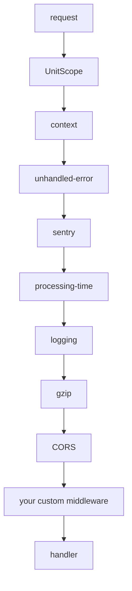

# FastAPI

```bash
pip install "servicewright[fastapi]"
```

A full-featured HTTP entrypoint: the platform middleware stack, RFC 9457 error handling,
Kubernetes probes, per-request DI scopes and a graceful drain — on a FastAPI app you still fully
control.

```python
from fastapi import APIRouter

from servicewright import AppSpec, Service
from servicewright.adapters.fastapi import FastApiEntrypoint, HttpConfig

router = APIRouter()


@router.get("/orders/{order_id}")
async def get_order(order_id: str) -> dict:
    return {"id": order_id}


http = FastApiEntrypoint(config=HttpConfig(port=8000), routers=(router,))
service = Service(spec, entrypoints=[http])
```

## The `/system` namespace

Everything operational lives under one prefix, so it is trivial to keep off your public router:

| Path | What |
| --- | --- |
| `/system/health/livez` | liveness probe |
| `/system/health/readyz` | readiness probe (503 when unhealthy) |
| `/system/metrics` | in-app Prometheus metrics (when `metrics=True`) |
| `/system/docs` | Swagger UI |
| `/system/redoc` | ReDoc |
| `/system/openapi.json` | the schema |

These paths are excluded from request logging and from tracing by default.

## Constructor

```python
FastApiEntrypoint(
    config=HttpConfig(),
    routers=(),
    routes_registerer=None,
    middlewares=MiddlewareConfig(),
    exception_handlers=None,
    default_exception_handlers=True,
    error_renderer=None,
    metrics=False,
    configure_app=None,
    kind="http",
    essential=True,
)
```

| Argument | Meaning |
| --- | --- |
| `config` | Server, app and health configuration. See below. |
| `routers` | `APIRouter` instances to include. |
| `routes_registerer` | `(app, ctx) -> None \| Awaitable`, called at bind time. For routes that need the `ServiceContext`. |
| `middlewares` | The middleware stack configuration. |
| `exception_handlers` | `{ExceptionType: handler}`, appended after the defaults. |
| `default_exception_handlers` | Install the built-in handlers. |
| `error_renderer` | Wire-format renderer; `None` means RFC 9457. See [Errors](../concepts/errors.md#own-the-wire-format). |
| `metrics` | Expose in-app request metrics at `/system/metrics`. |
| `configure_app` | `(app, ctx) -> None`, the final hook after everything is wired. |
| `kind`, `essential` | Telemetry label and failure semantics. See [Entrypoints](../concepts/entrypoints.md#kind-and-essential). |

## `HttpConfig`

| Field | Default | Meaning |
| --- | --- | --- |
| `host` | `"0.0.0.0"` | Bind host |
| `port` | `8000` | Bind port (`0` picks a free one; read it back from `bound_port`) |
| `graceful_timeout` | `10.0` | uvicorn's own shutdown timeout |
| `title` | `None` | OpenAPI title; defaults to `AppSpec.service_name` |
| `version` | `"0.0.0"` | OpenAPI version |
| `openapi_url` | `/system/openapi.json` | Schema path |
| `docs_url` | `/system/docs` | Swagger UI path |
| `redoc_url` | `/system/redoc` | ReDoc path |
| `redirect_slashes` | `False` | |
| `fastapi_kwargs` | `{}` | Merged into the `FastAPI(...)` call |
| `uvicorn_kwargs` | `{}` | Merged into the `uvicorn.Config(...)` call |
| `health` | `HealthConfig()` | Probe routes: `enabled`, `liveness_path`, `readiness_path` |

### From settings

The environment-facing side of the same field set ships with the adapter: `HttpServerSettings`,
one pydantic model per config dataclass — `HealthSettings`, `MiddlewareSettings` with its four
middleware sections, `UvicornSettings` — same field names, same defaults, `to_config()` on each.
Nest it in your settings object (`servicewright[settings]`'s `BaseServiceSettings`, or a
`BaseSettings` of your own with `env_nested_delimiter="__"`) and the mapping lives here rather than
in each service:

```python
from servicewright.adapters.fastapi import FastApiEntrypoint, HttpServerSettings
from servicewright.adapters.settings import BaseServiceSettings


class Settings(BaseServiceSettings):
    server: HttpServerSettings = HttpServerSettings()


settings = Settings()
http = FastApiEntrypoint(
    config=settings.server.to_config(version=settings.app_version),
    middlewares=settings.server.middlewares.to_config(),
    routers=(router,),
)
```

```bash
SERVER__PORT=8080
SERVER__GRACEFUL_TIMEOUT=15
SERVER__HEALTH__READINESS_PATH=/readyz
SERVER__UVICORN__TIMEOUT_KEEP_ALIVE=30
SERVER__UVICORN__FORWARDED_ALLOW_IPS=*
SERVER__MIDDLEWARES__GZIP__ENABLED=false
SERVER__MIDDLEWARES__CORS__ALLOW_ORIGINS='["https://app.example.com"]'
```

Every model is a plain `BaseModel`, never a `BaseSettings`, so the only way into `server.port` is
`SERVER__PORT`: a bare `PORT` or `HOST` in the pod cannot reach it. `HttpServerSettings().to_config()`
equals `HttpConfig()` and `MiddlewareSettings().to_config()` equals `MiddlewareConfig()`, and a test
asserts that each model names exactly the fields of its dataclass minus the members below, so a
field added to a dataclass cannot leave the mapping silently incomplete. `MiddlewareConfig` is the
entrypoint's own argument rather than part of `HttpConfig`, hence the second call.

The members that are code, not environment, are arguments of `to_config()` rather than fields:

| Argument | Of | Default | Why it is not read from settings |
| --- | --- | --- | --- |
| `version` | `HttpServerSettings.to_config` | `"0.0.0"` | The OpenAPI version is the application's, which `settings.app_version` carries once already |
| `unit_scope` | `MiddlewareSettings.to_config` | `True` | Whether your DI integration owns the request scope is decided where it is wired |
| `context_setters` | `MiddlewareSettings.to_config` | `None` | `ContextSetter` objects |
| `custom` | `MiddlewareSettings.to_config` | `()` | Middleware classes and their kwargs |

`fastapi_kwargs` and `uvicorn_kwargs` stay dict fields, JSON in the environment
(`SERVER__FASTAPI_KWARGS='{"debug": true}'`); anything that is not JSON — a `lifespan`, say — goes
onto the returned config afterwards, `config.fastapi_kwargs["lifespan"] = lifespan`.

`port=0` is rejected unless `allow_ephemeral_port=True`, as on
[`MetricsSettings`](../concepts/settings.md#validation-instead-of-silent-fallbacks): `0` only ever
arrives here from configuration (`SERVER__PORT`, one keystroke from `8000`), and a pod on an
ephemeral port is one no probe or load balancer reaches. `HttpConfig(port=0)` itself keeps working
and reports what it got through `bound_port`. CORS `allow_credentials=True` with a `*` origin fails
at load, with `server.middlewares.cors` in the error, rather than at construction.

#### The uvicorn knobs

`server.uvicorn` types the operational uvicorn arguments. Every field is `None` until set and only
a set field is forwarded, so uvicorn's own defaults apply to the rest and the model pins none of
them; `to_config()` puts exactly what was set into `HttpConfig.uvicorn_kwargs`, typed —
`SERVER__UVICORN__TIMEOUT_KEEP_ALIVE=30` arrives as the integer `30`, where the same key under a
`dict` field would arrive as the string `"30"`.

| Field | uvicorn's default | Meaning |
| --- | --- | --- |
| `proxy_headers` | `True` | Trust `X-Forwarded-*` from `forwarded_allow_ips` |
| `forwarded_allow_ips` | `127.0.0.1` | A list, a comma-separated string or `*` |
| `root_path` | `""` | ASGI root path, for an app served under a prefix |
| `server_header`, `date_header` | `True` | The `Server` and `Date` response headers |
| `timeout_keep_alive` | `5` | Seconds an idle keep-alive connection is held |
| `backlog` | `2048` | Listen backlog |
| `limit_concurrency` | none | Concurrent connections or tasks before new requests get a 503 |
| `limit_max_requests` | none | Requests served before the server exits — and the Host stops the process |
| `h11_max_incomplete_event_size` | h11's | Largest request line plus headers, bytes |
| `access_log` | `True` | uvicorn's own access log; the logging middleware writes one line per request already |
| `log_level` | none | Level of uvicorn's own loggers, `critical` … `trace`, any case |
| `ssl_keyfile`, `ssl_certfile`, `ssl_keyfile_password`, `ssl_ca_certs`, `ssl_cert_reqs`, `ssl_ciphers` | none | TLS termination in the process; uvicorn wraps the socket the runner bound |

`uvicorn_kwargs` is the escape hatch for the rest of `uvicorn.Config`'s signature and wins on a
collision, as it does on `HttpConfig` itself. A test asserts every typed field is a
`uvicorn.Config` parameter and lands there under its own name.

Not typed, on purpose, because the runner pre-binds the socket and drives one `uvicorn.Server`
directly:

| Parameter | Why |
| --- | --- |
| `workers` | Read only by `uvicorn.run()`'s multiprocess supervisor. `Server.serve()` is single-process, so a `workers` in `uvicorn_kwargs` is stored on the config and never consulted: one process per pod, always |
| `host`, `port`, `timeout_graceful_shutdown` | `server.host`, `server.port`, `server.graceful_timeout` |
| `log_config` | The Host owns logging; the runner passes `None` |
| `loop` | `run_sync(loop=...)` owns the loop |
| `reload*`, `uds`, `fd`, `env_file` | The development reloader, other ways to bind, another environment layer |

Not covered at all: cookie policy (`secure`, `httponly`, `samesite`) is an application concern and
stays in your settings; `MetricsInstrumentatorConfig` is callables and library kwargs, wired in
code as under [Metrics](#metrics); `LitestarConfig` has no settings model.

## Per-request dependency scope

`UnitScopeMiddleware` is installed automatically as the **outermost** middleware and opens one
[unit scope](../concepts/dependency-injection.md) per request. Reach it three ways:

```python
from servicewright.adapters.fastapi import UnitScopeDep, current_unit_scope

# 1. The dependency (most common)
@router.get("/orders/{order_id}")
async def get_order(order_id: str, scope: UnitScopeDep) -> dict:
    use_case = await scope.get(GetOrder)
    return await use_case.execute(order_id)


# 2. Off the request
async def handler(request: Request):
    scope = request.state.unit_scope


# 3. From anywhere in the call tree
def deep_inside_something():
    scope = current_unit_scope()
```

!!! note

    The middleware wraps **every** HTTP request, `/system/*` routes included, so a readiness probe
    opens and immediately closes a scope too. With dishka that costs almost nothing — dependencies
    are built on `get`, and a probe resolves none. It only matters if your container does eager
    work on scope entry.

!!! info "Why the scope survives streaming responses"

    The middleware is raw ASGI, not `BaseHTTPMiddleware`. The latter hands control back as soon as
    the response *starts*, which would close the scope — and with it your database session —
    while a streaming body is still being produced and before `BackgroundTask`s run. Awaiting the
    inner app to completion keeps the scope alive for the whole exchange.

### Letting your DI integration own the scope

If your DI library's own FastAPI integration already opens a request scope — dishka's
`setup_dishka()` with `FromDishka` / `@inject` handlers, for instance — switch the adapter's
middleware off so the two never open two scopes per request:

```python
from dishka.integrations.fastapi import setup_dishka

from servicewright.adapters.fastapi import FastApiEntrypoint, MiddlewareConfig


def configure_app(app: FastAPI, ctx: ServiceContext) -> None:
    setup_dishka(ctx.container.container, app)   # dishka's ContainerMiddleware, outermost


http = FastApiEntrypoint(
    routers=(router,),
    middlewares=MiddlewareConfig(unit_scope=False),
    configure_app=configure_app,
)
```

`unit_scope=False` drops `UnitScopeMiddleware` from the stack and nothing else: the context,
logging, error and Sentry layers, the probes and the graceful drain do not depend on it. In this
mode `UnitScopeDep`, `request.state.unit_scope` and `current_unit_scope()` raise `LookupError` —
resolve through the integration that owns the scope. See
[dishka](dishka.md#using-dishkas-own-fastapi-or-litestar-integration) for the full picture,
including what happens if both end up installed.

## Middleware stack

```python
from servicewright.adapters.fastapi import (
    CORSMiddlewareConfig,
    GZipMiddlewareConfig,
    LoggingMiddlewareConfig,
    MiddlewareConfig,
)

middlewares = MiddlewareConfig(
    unit_scope=True,
    context=True,
    sentry=True,
    processing_time=True,
    context_setters=None,
    logging=LoggingMiddlewareConfig(enabled=True, ignored_paths=["/system/health/livez"]),
    gzip=GZipMiddlewareConfig(enabled=True, minimum_size=1000),
    cors=CORSMiddlewareConfig(allow_origins=["https://app.example.com"]),
    custom=[(MyMiddleware, {"option": 1})],
)
```

Order, outermost first:



| Layer | Does |
| --- | --- |
| **UnitScope** | opens the per-request DI scope; everything below runs inside it. `unit_scope=False` leaves it out |
| **context** | extracts/mints correlation ids, binds them, echoes `X-Request-ID` |
| **unhandled-error** | renders a masked 500 *inside* the context layer, so it carries the request id |
| **sentry** | enriches the Sentry scope from the request context |
| **processing-time** | adds an `X-Process-Time` response header |
| **logging** | one structured line per request, through the configured logging sink |
| **gzip**, **CORS** | Starlette's own |
| **custom** | yours, innermost |

!!! warning "CORS defaults to no origins"

    `CORSMiddlewareConfig` starts with `allow_origins=[]`, so nothing is allowed until you say so.
    Combining `allow_credentials=True` with `allow_origins=["*"]` raises a `ValueError` at
    construction — that combination is insecure and browsers reject it anyway.

### The request id

`ContextMiddleware` owns it. It takes the client's `X-Request-ID` when the value is log-safe,
generates one otherwise, binds it into the [context store](../concepts/context.md) and returns it
in the response header.

Change the header name, or stop echoing:

```python
from servicewright.adapters.fastapi import CorrelationIdMiddlewareConfig

MiddlewareConfig(correlation_id=CorrelationIdMiddlewareConfig(header_name="X-Correlation-ID"))
MiddlewareConfig(correlation_id=CorrelationIdMiddlewareConfig(enabled=False))   # bind, do not echo
```

## Error handling

Five handlers are installed by default, all rendering through one pluggable renderer:

| Situation | Result |
| --- | --- |
| `RequestValidationError` | 422, `code="validation_error"`, sanitized field errors |
| `HTTPException` 4xx | that status, detail and headers preserved |
| `HTTPException` 5xx | masked internal error |
| `ServiceError` | its kind's status; masked when `public=False` |
| `DeadlineExceededError` | 504, `code="deadline_exceeded"` |
| anything unhandled | masked 500, logged with the request id |

```python
FastApiEntrypoint(
    error_renderer=MyEnvelopeRenderer(),           # own the wire format
    exception_handlers={LegacyError: my_handler},  # add your own types
    default_exception_handlers=False,              # or opt out entirely
)
```

Full details in [Errors](../concepts/errors.md).

## Metrics

```python
FastApiEntrypoint(metrics=True)
```

Instruments the app with `prometheus-fastapi-instrumentator` and exposes `/system/metrics` on the
API's own port, with `/system/*` excluded from instrumentation.

This is independent of the standalone exposition server that the
[Prometheus backend](observability-backends.md#prometheus-metrics) starts when
`settings.metrics.enabled` is true. Both write into the same registry.

To tune the instrumentator, wire it yourself:

```python
from servicewright.adapters.fastapi import MetricsInstrumentatorConfig, setup_metrics_instrumentator


def configure_app(app, ctx) -> None:
    setup_metrics_instrumentator(
        app,
        config=MetricsInstrumentatorConfig(init_kwargs={"should_group_status_codes": False}),
    )


FastApiEntrypoint(metrics=False, configure_app=configure_app)
```

`MetricsInstrumentatorConfig` is a pass-through, one field per call the wrapper makes: `init_kwargs`
to `Instrumentator(...)`, `instrumentations` to `.add(...)`, `instrument_kwargs` to
`.instrument(...)` and `expose_kwargs` to `.expose(...)`.

`instrumentations` takes the library's per-request callables — its own `metrics.request_size()` and
friends, or your own `Callable[[Info], None | Awaitable[None]]`. Anything passed there **replaces**
the default set rather than extending it, and the two do not combine: `metrics.default()` already
registers `http_request_size_bytes` / `http_response_size_bytes` (summaries labelled by handler
only), so a `request_size()` added next to it — the same series with method and status labels —
hits a duplicated time series and is silently dropped. To keep the built-ins alongside the
finer-labelled sizes, compose the set from the pieces:

```python
from prometheus_fastapi_instrumentator import metrics

MetricsInstrumentatorConfig(
    instrumentations=[
        metrics.requests(),
        metrics.latency(),
        metrics.request_size(),
        metrics.response_size(),
    ],
)
```

## Tracing

```bash
pip install "servicewright[fastapi-tracing]"
```

With `ObsConfig(tracing="otel")` and a configured `settings.tracing`, the entrypoint asks the
tracing sink to instrument the app at bind time — before the middleware stack, so spans wrap the
whole chain. The `/system/*` paths and `logging.ignored_paths` are excluded automatically, on top
of anything in `settings.tracing.excluded_urls`.

With tracing off, this is a no-op. Nothing is imported.

## Registering routes

Three ways, in the order they are applied:

```python
# 1. Routers
FastApiEntrypoint(routers=(orders_router, users_router))


# 2. A registerer, when routes need the ServiceContext
async def register_routes(app: FastAPI, ctx: ServiceContext) -> None:
    catalog = await ctx.app_scope.get(Catalog)
    app.include_router(build_router(catalog))


FastApiEntrypoint(routes_registerer=register_routes)


# 3. The final hook, after everything else is wired
def configure_app(app: FastAPI, ctx: ServiceContext) -> None:
    app.mount("/static", StaticFiles(directory="static"))


FastApiEntrypoint(configure_app=configure_app)
```

## Lifecycle notes

The app has **no lifespan** that manages your container. The Host already ran bootstrap, the
application scope, warmup and `pre_start` before `bind()` is called.

- **`bind()`** builds the app and opens the listening socket.
- **`serve()`** runs uvicorn with its signal capture neutralized, and returns — still accepting —
  when the Host's stop event is set.
- **`drain(grace)`** closes the listener and lets in-flight requests finish.
- **`stop()`** is the hard stop.

```python
http = FastApiEntrypoint(config=HttpConfig(port=0))
# after bind:
http.bound_port   # e.g. 54312
http.app          # the built FastAPI instance, or None before bind
```

## Testing

Build the app without running a server:

```python
from servicewright.testing import FakeContainer, FakeSettings

ctx = ServiceContext(bootstrap=..., app_scope=..., health=HealthRegistry())
app = await FastApiEntrypoint(routers=(router,)).build_app(ctx)

transport = httpx.ASGITransport(app=app)
async with httpx.AsyncClient(transport=transport, base_url="http://test") as client:
    response = await client.get("/orders/42")
```

See [Testing](../guides/testing.md) for the full setup.

## Handy header types

Common headers as ready-made annotated dependencies:

```python
from servicewright.adapters.fastapi import (
    AuthorizationHeader,   # Authorization
    IdempotencyKey,        # Idempotency-Key, validated and length-capped
    XFingerprintHeader,    # X-Fingerprint
    XUserId,               # X-User-Id, parsed as UUID
)


@router.post("/orders")
async def create_order(user_id: XUserId, idempotency_key: IdempotencyKey) -> dict: ...
```
