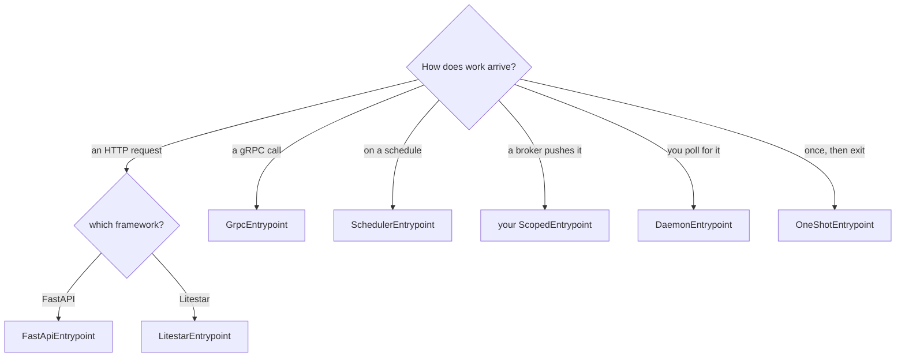

# Adapters

Everything that touches a third-party library lives in `servicewright.adapters`, behind an extra.
The kernel never imports any of it.

There are four families.

## Entrypoint adapters

How work enters your service.

| Adapter | Class | Best for | Extra |
| --- | --- | --- | --- |
| [FastAPI](fastapi.md) | `FastApiEntrypoint` | HTTP APIs, with the full platform middleware stack | `fastapi` |
| [Litestar](litestar.md) | `LitestarEntrypoint` | HTTP APIs on Litestar, deliberately lean | `litestar` |
| [gRPC](grpc.md) | `GrpcEntrypoint` | gRPC APIs, with health, reflection and error mapping | `grpc` |
| [Scheduler](scheduler.md) | `SchedulerEntrypoint` | cron and interval jobs | `apscheduler4` / `apscheduler3` |
| [Daemon](daemon-and-oneshot.md) | `DaemonEntrypoint` | a long-running loop you write yourself | — |
| [One-shot](daemon-and-oneshot.md) | `OneShotEntrypoint` | a batch job that runs once and exits | — |

Mix as many as you like in one `Service`. They share the container, the health registry, the
observability stack and the shutdown.

## Dependency injection

| Adapter | Class | Extra |
| --- | --- | --- |
| [dishka](dishka.md) | `DishkaContainer` | `dishka` |

Any other container works by implementing
[two methods](../concepts/dependency-injection.md#the-contract).

## Observability backends

| Concern | Backend | Extra |
| --- | --- | --- |
| metrics | `prometheus` | `metrics` |
| tracing | `otel` | `observability` |
| error tracking | `sentry` | `sentry` |
| logging | `structlog` | `observability` |
| logging | `stdlib` | — |

See [Observability backends](observability-backends.md), including how to add your own.

## Infrastructure

Warmers and health checks for the usual suspects.

| Component | Class | Extra |
| --- | --- | --- |
| Postgres | `PostgresWarmer`, `PostgresHealthCheck` | `postgres` |
| Redis | `RedisWarmer`, `RedisHealthCheck` | `redis` |
| Kafka | `KafkaProducerWarmer` | `kafka` |

See [Infrastructure](infrastructure.md).

## What every entrypoint adapter has in common

Once you know one, you know the shape of the rest:

- **It carries its own config object**, passed at construction. Server settings never come from
  the global settings object, which is what keeps `AppSpec` transport-neutral.
- **The Host owns the lifecycle.** The adapter installs no signal handlers, runs no lifespan that
  manages your container, and never calls `sys.exit`.
- **`bind()` allocates, `serve()` waits, `drain()` closes, `stop()` kills.** Servers open their
  listening socket during `bind`, so a port clash aborts startup instead of producing a process
  that reports ready and serves nothing.
- **It opens the per-unit DI scope** at the right boundary, and hands it to you.
- **It ships a `*Plugin` twin** taking identical arguments, for
  [plugin-style wiring](../concepts/plugins.md).
- **`bound_port`** tells you what the OS actually picked when you configure `port=0`, which is how
  the tests and examples run against ephemeral ports.
