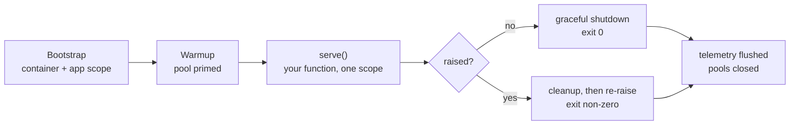

# Blueprint: batch job

Work that runs once and exits: a migration, a backfill, a nightly export, a one-off repair script.

The temptation is to write a bare `asyncio.run(main())` script. Then it needs the same DI
container as the service, and the same connection pooling, and someone notices it never flushed
its Sentry events, and it grows a `try/finally`. An `OneShotEntrypoint` gives you the service's
whole lifecycle for four lines.

## The shape

```python title="jobs/backfill_main.py"
import asyncio

from servicewright import OneShotEntrypoint, Service, UnitScopeProtocol


async def backfill_order_totals(scope: UnitScopeProtocol) -> None:
    use_case = await scope.get(BackfillOrderTotalsUseCase)
    updated = await use_case.execute(batch_size=500)
    print(f"backfilled {updated} orders")


def main() -> None:
    settings = Settings()
    service = Service(
        build_spec(settings),
        entrypoints=[OneShotEntrypoint(backfill_order_totals, kind="backfill")],
    )
    asyncio.run(service.run(settings))


if __name__ == "__main__":
    main()
```



## Why exit codes matter here

`OneShotEntrypoint` is `essential=True`, so its return stops the whole service:

| Outcome | Exit code | Kubernetes `Job` |
| --- | --- | --- |
| function returns | `0` | succeeded |
| function raises | non-zero | retried up to `backoffLimit`, then failed |
| warmup fails (bad DSN) | non-zero | retried — correctly, since it never ran |

The exception propagates **after** cleanup, so the traceback is logged, Sentry has it, spans are
flushed and the pool is closed before the process dies. A bare script gets none of that.

## Deploy

```yaml
apiVersion: batch/v1
kind: Job
metadata:
  name: orders-backfill-totals
spec:
  backoffLimit: 3
  ttlSecondsAfterFinished: 86400
  template:
    spec:
      restartPolicy: Never
      containers:
        - name: backfill
          image: registry.example.com/orders-service:1.4.0
          command: ["python", "-m", "orders_service.jobs.backfill_main"]
          env:
            - name: DATABASE_DSN
              valueFrom: { secretKeyRef: { name: orders-db, key: dsn } }
            - name: LOGGING__LEVEL
              value: INFO
```

Same image as the service. Only the command differs.

## Migrations

The classic use: run Alembic before the new version starts serving.

```python title="jobs/migrate_main.py"
async def migrate(scope: UnitScopeProtocol) -> None:
    migrator = await scope.get(Migrator)
    await migrator.upgrade("head")
```

As an `initContainer`, or a `helm.sh/hook: pre-upgrade` Job, or simply a `Job` your pipeline waits
on. Whichever you use, a failure is a non-zero exit and the rollout stops.

!!! tip "Migrations rarely want warmup"

    A migration that also warms a Redis pool it will never touch is just a slower migration. Build
    a leaner spec for jobs:

    ```python
    def build_job_spec(settings: Settings) -> AppSpec:
        return AppSpec(
            service_name="orders-migrate",
            create_container=build_container,
            observability=ObservabilityManager(ObsConfig(logging="structlog")),
            cleanup_timeout_seconds=30.0,   # let the flush finish
        )
    ```

## Arguments

Read them from the environment, or parse them before building the service:

```python
def main() -> None:
    parser = argparse.ArgumentParser()
    parser.add_argument("--since", type=date.fromisoformat, required=True)
    args = parser.parse_args()

    async def export(scope: UnitScopeProtocol) -> None:
        use_case = await scope.get(ExportOrdersUseCase)
        await use_case.execute(since=args.since)

    settings = Settings()
    service = Service(build_spec(settings), entrypoints=[OneShotEntrypoint(export)])
    asyncio.run(service.run(settings))
```

The closure captures the arguments; the entrypoint stays a plain function of the scope.

## Make it interruptible

A long backfill will be evicted eventually — a node drain, a spot instance, an operator with a
deadline. Batch work should checkpoint and honour cancellation:

```python
async def backfill(scope: UnitScopeProtocol) -> None:
    use_case = await scope.get(BackfillUseCase)
    cursor = await use_case.load_checkpoint()
    while (batch := await use_case.next_batch(cursor)):
        await use_case.process(batch)
        cursor = await use_case.save_checkpoint(batch.last_id)
```

On `SIGTERM` the Host cancels `serve()` at the next await point, and the last saved checkpoint
means the retry resumes instead of restarting. Give the Job a
`terminationGracePeriodSeconds` large enough for one batch to finish.

## `Job` + `CronJob`, or a scheduler entrypoint?

Both run work on a schedule. They fail differently.

| | Kubernetes `CronJob` | [`SchedulerEntrypoint`](../adapters/scheduler.md) |
| --- | --- | --- |
| Process | fresh per run | long-lived |
| Cold start | every run pays warmup | paid once |
| Missed runs | `startingDeadlineSeconds` | `misfire_grace_time` |
| Overlap control | `concurrencyPolicy` | `max_instances` |
| Multiple replicas | safe | **duplicate runs** — keep at 1 replica |
| Failure visibility | Job status, `kubectl get jobs` | your logs and metrics |
| Sub-minute intervals | no | yes |
| Ops ownership | the cluster | the service |

Rules of thumb:

- **heavy, infrequent, independently retryable** (nightly export, monthly billing) → `CronJob` with
  a one-shot entrypoint;
- **frequent, light, sharing warm state** (expire orders every five minutes, poll a queue) →
  `SchedulerEntrypoint` in the worker.

## Next

- [Worker](worker.md) — the long-lived counterpart.
- [Kubernetes](../operations/kubernetes.md) — probes, grace periods and exit codes in detail.
