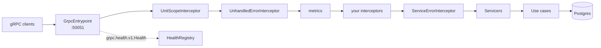

# Blueprint: gRPC service

The same service as the [HTTP blueprint](http-api.md) — settings, container, domain, warmup and
health are identical — with a gRPC entrypoint in front.

```bash
pip install "servicewright[grpc,dishka,postgres,metrics,observability]"
```

## What you are building



## 1. Servicers

The scope is reachable from anywhere inside the RPC — no parameter threading:

```python title="api/grpc/servicers/orders.py"
from servicewright.adapters.grpc import current_unit_scope

from orders_service.generated import orders_pb2, orders_pb2_grpc


class OrdersServicer(orders_pb2_grpc.OrdersServicer):
    async def GetOrder(self, request, context) -> orders_pb2.Order:
        scope = current_unit_scope()
        use_case = await scope.get(GetOrderUseCase)
        order = await use_case.execute(UUID(request.order_id))
        return orders_pb2.Order(id=str(order.id), status=order.status)

    async def ListOrders(self, request, context):
        scope = current_unit_scope()
        use_case = await scope.get(ListOrdersUseCase)
        async for order in use_case.stream(request.customer_id):
            yield orders_pb2.Order(id=str(order.id), status=order.status)
```

Streaming works the same way: the unit scope stays open for the whole stream, so the session
backing that generator is alive until the last message.

`OrderNotFoundError` raised in the use case becomes a `NOT_FOUND` abort with `x-error-code:
order_not_found` in the trailing metadata. Nothing to catch, nothing to map.

## 2. Registration

`settings.grpc` is grpc-server-kit's `BaseGrpcServerSettings`, one more section on the
[HTTP blueprint's `Settings`](http-api.md#1-settings) — host, port, TLS, keepalive, message sizes,
grace period, all `GRPC__*` in the environment:

```python title="settings.py"
from grpc_server_kit.settings import BaseGrpcServerSettings


class Settings(BaseServiceSettings):
    ...
    grpc: BaseGrpcServerSettings = BaseGrpcServerSettings()
```

`GrpcConfig.from_settings` reads every one of those fields; its keywords cover what no settings
object carries — here, which servicers to report health for and to advertise:

```python title="runtime/entrypoints.py"
from servicewright import ServiceContext
from servicewright.adapters.grpc import GrpcConfig, GrpcEntrypoint

from orders_service.generated import orders_pb2_grpc

ORDERS_SERVICE = "orders.v1.Orders"


def register_servicers(server, ctx: ServiceContext) -> None:
    orders_pb2_grpc.add_OrdersServicer_to_server(OrdersServicer(), server)


def build_grpc(settings: Settings) -> GrpcEntrypoint:
    return GrpcEntrypoint(
        config=GrpcConfig.from_settings(
            settings.grpc,
            health_service_names=(ORDERS_SERVICE,),
            reflection_service_names=[ORDERS_SERVICE],
        ),
        servicers=register_servicers,
        interceptors=[AuthInterceptor(), LoggingInterceptor()],
        enable_metrics=settings.grpc.metrics_enabled,
    )
```

The values are the settings model's, defaults included: its `grace_period` is 5 s, so set
`GRPC__GRACE_PERIOD=30` to spend the Host's whole drain allowance, as the
[deployment below](#5-deploy) assumes.

!!! danger "Reflection is unauthenticated and shares the production port"

    Gate it on the environment: `GRPC__ENABLE_REFLECTION=true` in dev and staging, unset in
    production. The same goes for channelz, which additionally leaks peer addresses and
    per-socket counters. See
    [the gRPC adapter](../adapters/grpc.md#health-reflection-and-channelz).

## 3. Interceptor ordering

Your interceptors land between the framework's:

```
UnitScopeInterceptor        ← scope is live for everything below
  UnhandledErrorInterceptor ← nothing below leaves without a status
    metrics                 ← records the status the client receives
      AuthInterceptor       ← yours
      LoggingInterceptor    ← yours
        ServiceErrorInterceptor
          OrdersServicer
```

That is why a generic "map everything to INTERNAL" interceptor of yours cannot swallow a
deliberate `NOT_FOUND`: the domain error has already become an abort by the time it reaches you.
And it is why anything your interceptors do *not* map still reaches the client as `INTERNAL` with
`x-error-code: internal_error` rather than as `UNKNOWN` plus the exception's own text.

## 4. main

```python title="grpc_main.py"
import asyncio

from servicewright import Service


def main() -> None:
    settings = Settings()
    service = Service(build_spec(settings), entrypoints=[build_grpc(settings)])
    asyncio.run(service.run(settings))


if __name__ == "__main__":
    main()
```

## 5. Deploy

```yaml
spec:
  template:
    spec:
      terminationGracePeriodSeconds: 60
      containers:
        - name: grpc
          command: ["python", "-m", "orders_service.grpc_main"]
          ports: [{ containerPort: 50051, name: grpc }]
          readinessProbe:
            grpc: { port: 50051 }
            periodSeconds: 5
          livenessProbe:
            grpc: { port: 50051 }
            periodSeconds: 10
            failureThreshold: 6
```

The health service is registered automatically and reports `SERVING` exactly while readiness is
healthy, re-evaluated every `health_refresh_interval` seconds.

!!! tip "Liveness on the same health service"

    It is the same endpoint, so give liveness a much looser `failureThreshold` than readiness.
    Otherwise a database outage restarts pods instead of draining them.

## Serving HTTP and gRPC together

A gRPC service still benefits from an HTTP port — Prometheus scraping, a debug endpoint, a legacy
REST facade:

```python
service = Service(build_spec(settings), entrypoints=[
    build_grpc(settings),
    build_http(settings),      # same container, same health registry
])
```

Both bind during startup, both drain on shutdown, one `/system/health/readyz` and one
`grpc.health.v1.Health` telling the same truth.

## Metrics

`enable_metrics=True` records through the app's configured backend:

| Metric | Labels |
| --- | --- |
| `grpc_requests_total` | `service`, `method`, `status`, `grpc_code` |
| `grpc_request_duration_seconds` | `service`, `method` |

For a gRPC-only process there is no HTTP port to scrape, so turn on the standalone exposition
server instead:

```python
MetricsSettings(enabled=True, port=9090)
```

## Next

- [gRPC adapter reference](../adapters/grpc.md) — every config field and the full interceptor story.
- [Background worker](worker.md) — the third process type.
