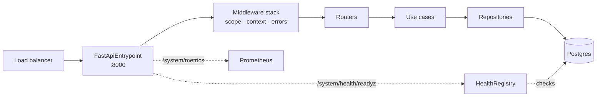

# Blueprint: HTTP API service

A complete, production-shaped HTTP service: Postgres through dishka, warmup, health checks, JSON
logs, Prometheus metrics, RFC 9457 errors and a Kubernetes-correct shutdown.

Copy it, rename it, delete what you do not need.

```bash
pip install "servicewright[fastapi,dishka,postgres,metrics,observability]"
```

## What you are building



## 1. Settings

```python title="runtime/settings.py"
from pydantic import BaseModel
from pydantic_settings import BaseSettings, SettingsConfigDict


class LoggingSettings(BaseModel):
    level: str = "INFO"
    use_json: bool = True


class MetricsSettings(BaseModel):
    enabled: bool = False        # the API exposes /system/metrics on its own port
    host: str = "0.0.0.0"
    port: int = 9090
    prefix: str | None = None


class HttpSettings(BaseModel):
    host: str = "0.0.0.0"
    port: int = 8000
    cors_origins: list[str] = []


class Settings(BaseSettings):
    model_config = SettingsConfigDict(env_nested_delimiter="__", env_file=".env")

    app_version: str = "0.0.0"
    environment: str = "local"
    database_dsn: str

    http: HttpSettings = HttpSettings()
    logging: LoggingSettings = LoggingSettings()
    metrics: MetricsSettings = MetricsSettings()
    tracing: None = None
    error_tracking: None = None

    def get_app_version(self) -> str:
        return self.app_version
```

## 2. Container

```python title="infra/di/providers.py"
from collections.abc import AsyncIterator

from dishka import Provider, Scope, provide
from sqlalchemy.ext.asyncio import AsyncEngine, AsyncSession, async_sessionmaker, create_async_engine


class DatabaseProvider(Provider):
    def __init__(self, dsn: str) -> None:
        super().__init__()
        self._dsn = dsn

    @provide(scope=Scope.APP)
    async def engine(self) -> AsyncIterator[AsyncEngine]:
        engine = create_async_engine(self._dsn, pool_size=10, pool_pre_ping=True)
        yield engine
        await engine.dispose()            # runs when the app scope closes — last

    @provide(scope=Scope.APP)
    def session_maker(self, engine: AsyncEngine) -> async_sessionmaker[AsyncSession]:
        return async_sessionmaker(engine, expire_on_commit=False)

    @provide(scope=Scope.REQUEST)
    async def session(self, maker: async_sessionmaker[AsyncSession]) -> AsyncIterator[AsyncSession]:
        async with maker() as session:
            yield session                 # closed when the unit scope closes


class UseCaseProvider(Provider):
    scope = Scope.REQUEST

    @provide
    def orders(self, session: AsyncSession) -> OrderRepository:
        return PostgresOrderRepository(session)

    @provide
    def get_order(self, orders: OrderRepository) -> GetOrderUseCase:
        return GetOrderUseCase(orders)
```

```python title="runtime/container.py"
from dishka import make_async_container

from servicewright.adapters.dishka import DishkaContainer


def build_container(settings: Settings) -> DishkaContainer:
    return DishkaContainer(
        make_async_container(
            DatabaseProvider(settings.database_dsn),
            UseCaseProvider(),
        )
    )
```

## 3. Domain errors

```python title="core/orders/errors.py"
from servicewright import ErrorKind, ServiceError


class OrderNotFoundError(ServiceError):
    kind = ErrorKind.NOT_FOUND          # code → "order_not_found", HTTP 404


class OrderAlreadyPaidError(ServiceError):
    kind = ErrorKind.CONFLICT           # code → "order_already_paid", HTTP 409


class PaymentGatewayError(ServiceError):
    kind = ErrorKind.UNAVAILABLE
    public = False                      # masked: the client never sees the reason
```

## 4. Router

```python title="api/http/routers/orders.py"
from fastapi import APIRouter

from servicewright.adapters.fastapi import UnitScopeDep

router = APIRouter(prefix="/orders", tags=["orders"])


@router.get("/{order_id}", response_model=OrderResponse)
async def get_order(order_id: UUID, scope: UnitScopeDep) -> OrderResponse:
    use_case = await scope.get(GetOrderUseCase)
    order = await use_case.execute(order_id)
    return OrderResponse.model_validate(order)


@router.post("", response_model=OrderResponse, status_code=201)
async def create_order(payload: CreateOrderRequest, scope: UnitScopeDep) -> OrderResponse:
    use_case = await scope.get(CreateOrderUseCase)
    order = await use_case.execute(payload.to_dto())
    return OrderResponse.model_validate(order)
```

Raise `OrderNotFoundError` inside the use case and the 404 problem document writes itself.

## 5. The spec

The interesting part: warmers and health checks need dependencies that live **in the container**,
which does not exist when `build_spec()` runs. Two hooks solve it.

```python title="runtime/spec.py"
from sqlalchemy.ext.asyncio import AsyncSession, async_sessionmaker

from servicewright import AppSpec, AppScopeProtocol, KeyRedactor, ObsConfig, ObservabilityManager, ServiceContext
from servicewright.adapters.health.postgres import PostgresHealthCheck
from servicewright.adapters.warmers.postgres import PostgresWarmer


def build_spec(settings: Settings) -> AppSpec:
    spec = AppSpec(
        service_name="orders-service",
        create_container=build_container,
        observability=ObservabilityManager(
            ObsConfig(metrics="prometheus", logging="structlog"),
            redactor=KeyRedactor(),
        ),
        drain_grace_seconds=30.0,
        cleanup_timeout_seconds=10.0,
    )

    async def build_warmers(ctx: ServiceContext) -> list:
        """Runs with the app scope open, before readiness."""
        maker = await ctx.app_scope.get(async_sessionmaker[AsyncSession])
        return [PostgresWarmer(SessionManagerAdapter(maker), timeout=10.0)]

    async def register_health_checks(app_scope: AppScopeProtocol | None = None) -> None:
        """pre_start runs after warmup, before bind — checks exist before the first probe."""
        maker = await app_scope.get(async_sessionmaker[AsyncSession])
        spec.health.add_check("postgres", PostgresHealthCheck(maker, timeout=5.0))

    spec.warmers_factory = build_warmers
    spec.lifecycle.add_pre_start_hook(register_health_checks)
    return spec
```

!!! note "`PostgresWarmer` and `PostgresHealthCheck` want different objects"

    The check calls `session_maker()`. The warmer calls `session_manager.get_session()`. If you
    are not using a manager with that shape, a five-line adapter closes the gap:

    ```python
    class SessionManagerAdapter:
        def __init__(self, maker: async_sessionmaker[AsyncSession]) -> None:
            self._maker = maker

        def get_session(self):
            return self._maker()
    ```

## 6. The entrypoint and main

```python title="runtime/entrypoints.py"
from servicewright.adapters.fastapi import CORSMiddlewareConfig, FastApiEntrypoint, HttpConfig, MiddlewareConfig


def build_http(settings: Settings) -> FastApiEntrypoint:
    return FastApiEntrypoint(
        config=HttpConfig(
            host=settings.http.host,
            port=settings.http.port,
            version=settings.app_version,
            graceful_timeout=10.0,
        ),
        routers=(orders_router,),
        middlewares=MiddlewareConfig(
            cors=CORSMiddlewareConfig(allow_origins=settings.http.cors_origins),
        ),
        metrics=True,
    )
```

```python title="api_main.py"
import asyncio

from servicewright import Service


def main() -> None:
    settings = Settings()
    service = Service(build_spec(settings), entrypoints=[build_http(settings)])
    asyncio.run(service.run(settings))


if __name__ == "__main__":
    main()
```

## 7. Deploy

```yaml
spec:
  replicas: 3
  strategy:
    rollingUpdate: { maxSurge: 1, maxUnavailable: 0 }
  template:
    spec:
      terminationGracePeriodSeconds: 60      # > 30 drain + 10 cleanup
      containers:
        - name: api
          command: ["python", "-m", "orders_service.api_main"]
          ports: [{ containerPort: 8000 }]
          env:
            - name: DATABASE_DSN
              valueFrom: { secretKeyRef: { name: orders-db, key: dsn } }
            - name: HTTP__CORS_ORIGINS
              value: '["https://app.example.com"]'
          livenessProbe:
            httpGet: { path: /system/health/livez, port: 8000 }
            periodSeconds: 10
          readinessProbe:
            httpGet: { path: /system/health/readyz, port: 8000 }
            periodSeconds: 5
```

More in [Kubernetes](../operations/kubernetes.md).

## What you now have

- `GET /orders/{id}` with a per-request session, committed or rolled back by the DI scope.
- `/system/health/livez` and `/system/health/readyz`, the latter red until Postgres answers.
- A pod that refuses to start when the database is unreachable, instead of serving 500s.
- JSON logs where every line carries the `request_id` the client got back in `X-Request-ID`.
- `/system/metrics` with request counts, durations and in-progress gauges.
- A rollout that drops no requests.

## Next

- [gRPC service](grpc-service.md) — the same service, other transport.
- [Production checklist](../operations/checklist.md) — before you ship it.
- [Runbooks](../operations/runbooks.md) — when it misbehaves.
