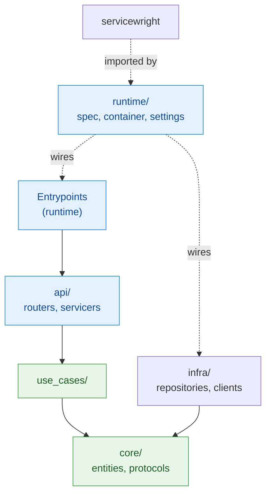

# Project layout

servicewright does not impose a project structure. But after a few services you end up wanting the
same one, so here it is — along with the single rule that matters.

## The rule

> **servicewright appears in one package only.**

Your domain, your use cases and your repositories must not import it. If the runtime ever changes,
you rewrite one folder, not the service.

```
core/  use_cases/  infra/   →  know nothing about servicewright
api/                        →  knows FastAPI/gRPC, not the Host
runtime/                    →  the only place that imports servicewright
```

## The tree

```
orders-service/
├── src/orders_service/
│   │
│   ├── core/                     # Domain. Pure Python.
│   │   └── orders/
│   │       ├── entities.py       # Order, OrderStatus
│   │       ├── repositories.py   # OrderRepository (Protocol)
│   │       ├── errors.py         # OrderNotFoundError(ServiceError)
│   │       └── services.py       # OrderDomainService
│   │
│   ├── use_cases/                # Application. Orchestration only.
│   │   └── orders/
│   │       ├── get_order.py      # GetOrderUseCase
│   │       └── expire_orders.py  # ExpireOrdersUseCase
│   │
│   ├── infra/                    # Implementations. Talks to the world.
│   │   ├── db/
│   │   │   ├── orm/              # SQLAlchemy models
│   │   │   └── uow.py
│   │   ├── repositories/         # PostgresOrderRepository
│   │   ├── clients/              # HTTP/gRPC clients
│   │   └── di/
│   │       └── providers/        # dishka providers
│   │
│   ├── api/                      # Transport. Framework-aware.
│   │   ├── http/
│   │   │   ├── routers/
│   │   │   └── schemas.py
│   │   └── grpc/
│   │       └── servicers/
│   │
│   ├── runtime/                  # ← the only servicewright imports
│   │   ├── settings.py           # Settings + sections
│   │   ├── container.py          # build_container(settings)
│   │   ├── spec.py               # build_spec() -> AppSpec
│   │   ├── entrypoints.py        # build_http(), build_cron()
│   │   └── jobs.py               # scheduled job functions
│   │
│   ├── api_main.py               # Service(spec, entrypoints=[http])
│   └── worker_main.py            # Service(spec, entrypoints=[cron, consumer])
│
├── tests/
│   ├── unit/
│   └── integration/
├── migrations/
├── Dockerfile
└── pyproject.toml
```

## How the layers map



| Layer | Contains | May import servicewright? |
| --- | --- | --- |
| `core/` | entities, repository protocols, domain errors | only `ServiceError` / `ErrorKind` |
| `use_cases/` | orchestration, transactions | no |
| `infra/` | repositories, clients, DI providers | no |
| `api/` | routers, servicers, converters | `UnitScopeDep`, `current_unit_scope` |
| `runtime/` | settings, container, spec, entrypoints | yes — this is its home |

!!! note "The one honest exception"

    `core/` may import `ServiceError` and `ErrorKind`, because a domain error *is* a domain
    concept and the taxonomy is pure stdlib. That import is what buys you a correct 404 over HTTP
    and `NOT_FOUND` over gRPC without your domain knowing either exists.

## The runtime package

Four small files, each with one job.

=== "settings.py"

    ```python
    from pydantic import BaseModel
    from pydantic_settings import SettingsConfigDict

    from servicewright.adapters.settings import BaseServiceSettings


    class HttpSettings(BaseModel):
        host: str = "0.0.0.0"
        port: int = 8000


    class Settings(BaseServiceSettings):
        model_config = SettingsConfigDict(env_file=".env")

        database_dsn: str

        http: HttpSettings = HttpSettings()
    ```

=== "container.py"

    ```python
    from dishka import make_async_container

    from servicewright.adapters.dishka import DishkaContainer

    from orders_service.infra.di.providers import DatabaseProvider, UseCaseProvider


    def build_container(settings: Settings) -> DishkaContainer:
        return DishkaContainer(
            make_async_container(
                DatabaseProvider(settings.database_dsn),
                UseCaseProvider(),
            )
        )
    ```

=== "spec.py"

    ```python
    from servicewright import AppSpec, KeyRedactor, ObsConfig, ObservabilityManager

    from orders_service.runtime.container import build_container


    def build_spec(settings: Settings) -> AppSpec:
        spec = AppSpec(
            service_name="orders-service",
            create_container=build_container,
            observability=ObservabilityManager(
                ObsConfig(metrics="prometheus", logging="structlog"),
                redactor=KeyRedactor(),
            ),
            drain_grace_seconds=30.0,
            cleanup_timeout_seconds=10.0,
        )
        register_infrastructure(spec, settings)
        return spec


    def register_infrastructure(spec: AppSpec, settings: Settings) -> None:
        """Warmers and health checks — shared by every process type."""
        ...
    ```

=== "entrypoints.py"

    ```python
    from servicewright.adapters.fastapi import FastApiEntrypoint, HttpConfig

    from orders_service.api.http.routers import orders_router


    def build_http(settings: Settings) -> FastApiEntrypoint:
        return FastApiEntrypoint(
            config=HttpConfig(
                host=settings.http.host,
                port=settings.http.port,
                version=settings.app_version,
            ),
            routers=(orders_router,),
            metrics=True,
        )
    ```

## Entry points as separate mains

```python title="api_main.py"
from servicewright import Service, run_sync

from orders_service.runtime.entrypoints import build_http
from orders_service.runtime.settings import Settings
from orders_service.runtime.spec import build_spec


def main() -> None:
    settings = Settings()
    service = Service(build_spec(settings), entrypoints=[build_http(settings)])
    run_sync(service, settings)


if __name__ == "__main__":
    main()
```

```python title="worker_main.py"
from servicewright import Service, run_sync

from orders_service.runtime.entrypoints import build_cron, build_outbox_daemon
from orders_service.runtime.settings import Settings
from orders_service.runtime.spec import build_spec


def main() -> None:
    settings = Settings()
    service = Service(
        build_spec(settings),
        entrypoints=[build_cron(settings), build_outbox_daemon(settings)],
    )
    run_sync(service, settings)


if __name__ == "__main__":
    main()
```

Same spec, same container, same warmup and health — two deployments with independent scaling. In
development, run both entrypoint lists in one process and skip the second container entirely.

## Dockerfile

One image, several commands:

```dockerfile
FROM python:3.12-slim AS base
ENV PYTHONUNBUFFERED=1 PYTHONDONTWRITEBYTECODE=1
WORKDIR /app

COPY --from=ghcr.io/astral-sh/uv:latest /uv /usr/local/bin/uv

COPY pyproject.toml uv.lock ./
RUN uv sync --frozen --no-dev --no-install-project

COPY src/ ./src/
RUN uv sync --frozen --no-dev

ENV PATH="/app/.venv/bin:$PATH"
USER nobody

CMD ["python", "-m", "orders_service.api_main"]
```

```yaml
# api deployment
command: ["python", "-m", "orders_service.api_main"]
# worker deployment
command: ["python", "-m", "orders_service.worker_main"]
```

## Testing layout

```
tests/
├── conftest.py            # shared fixtures: settings, container, service context
├── unit/
│   ├── test_use_cases.py  # no servicewright at all
│   └── test_domain.py
└── integration/
    ├── test_http_api.py   # build_app() + httpx
    └── test_jobs.py
```

Most tests never touch the runtime. See [Testing](../guides/testing.md).

## Next

- [HTTP API service](http-api.md) — the same layout, filled in.
- [Background worker](worker.md) — cron, consumer and outbox in one process.
