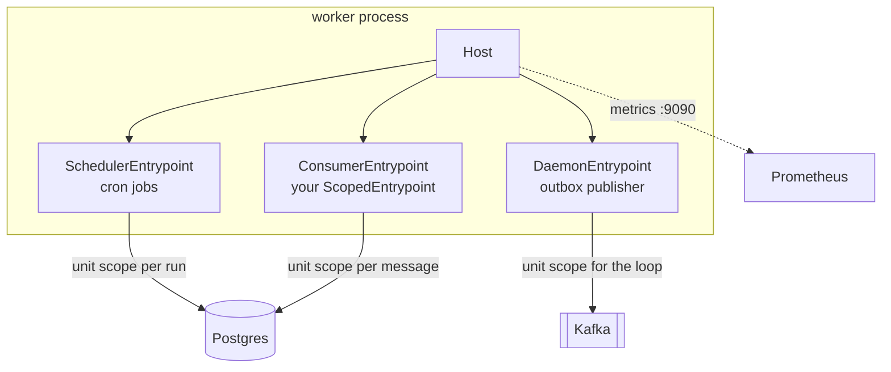

# Blueprint: background worker

A worker process with three jobs running side by side: scheduled cleanup, an outbox publisher, and
a message consumer. One container, one shutdown.

```bash
pip install "servicewright[apscheduler4,dishka,postgres,kafka,metrics,observability]"
```

## What you are building



## 1. Scheduled jobs

```python title="runtime/jobs.py"
from apscheduler.triggers.cron import CronTrigger
from apscheduler.triggers.interval import IntervalTrigger

from servicewright import UnitScopeProtocol
from servicewright.adapters.apscheduler4 import ScheduledJob


async def expire_orders(scope: UnitScopeProtocol) -> None:
    use_case = await scope.get(ExpireOrdersUseCase)
    expired = await use_case.execute()
    logger.info("Orders expired", extra={"count": expired})


async def send_daily_digest(scope: UnitScopeProtocol, recipient: str) -> None:
    use_case = await scope.get(SendDigestUseCase)
    await use_case.execute(recipient)


JOBS = [
    ScheduledJob(
        id="expire-orders",
        func=expire_orders,
        trigger=IntervalTrigger(minutes=5),
        max_instances=1,          # never two runs at once
        misfire_grace_time=60.0,  # skip a run missed by more than a minute
    ),
    ScheduledJob(
        id="daily-digest",
        func=send_daily_digest,
        trigger=CronTrigger(hour=6, minute=0),
        args=("ops@example.com",),
    ),
]
```

Each run gets a fresh DI scope, so each gets its own session and transaction. A run that raises is
logged with `job_id` and `run_id`; the scheduler keeps going.

!!! danger "Run the scheduler at replicas: 1"

    APScheduler here is in-process and in-memory. Three replicas means three schedulers means
    **three runs** of every job.

    Either keep the scheduler deployment at one replica, or give your jobs a distributed lock:

    ```python
    async def expire_orders(scope: UnitScopeProtocol) -> None:
        locks = await scope.get(LockService)
        async with locks.try_acquire("expire-orders") as acquired:
            if not acquired:
                return
            ...
    ```

## 2. The outbox publisher

A long-running loop belongs in a `DaemonEntrypoint`:

```python title="runtime/daemons.py"
import asyncio
import contextlib

from servicewright import UnitScopeProtocol

POLL_INTERVAL_SECONDS = 1.0


async def publish_outbox(scope: UnitScopeProtocol, stop: asyncio.Event) -> None:
    publisher = await scope.get(OutboxPublisher)
    while not stop.is_set():
        published = await publisher.publish_batch(limit=100)
        if published:
            continue                                  # drain fast while there is work
        with contextlib.suppress(TimeoutError):
            await asyncio.wait_for(stop.wait(), timeout=POLL_INTERVAL_SECONDS)
```

Two details worth copying: the loop skips the sleep while there is a backlog, and it waits on
`stop` instead of sleeping — so `SIGTERM` is honoured in milliseconds, not a full poll interval.

!!! note "One scope for the whole loop"

    `DaemonEntrypoint` opens a single unit scope that lives as long as the loop. That fits a
    publisher holding one connection. If each batch deserves its own session, write a
    [`ScopedEntrypoint`](../guides/custom-entrypoint.md) and open a scope per iteration.

## 3. The consumer

There is no bundled consumer entrypoint — brokers differ too much. Writing one is about thirty
lines, and it is the canonical `ScopedEntrypoint`:

```python title="runtime/consumer.py"
import asyncio
import logging

from servicewright import ScopedEntrypoint, ServiceContext

logger = logging.getLogger(__name__)


class OrdersConsumerEntrypoint(ScopedEntrypoint):
    kind = "kafka"
    essential = True

    def __init__(self, brokers: str, topic: str, group_id: str) -> None:
        super().__init__()
        self._brokers, self._topic, self._group_id = brokers, topic, group_id
        self._consumer: AIOKafkaConsumer | None = None

    async def bind(self, ctx: ServiceContext) -> None:
        await super().bind(ctx)                       # captures the container
        self._consumer = AIOKafkaConsumer(
            self._topic,
            bootstrap_servers=self._brokers,
            group_id=self._group_id,
            enable_auto_commit=False,
        )
        await self._consumer.start()                  # joins the group, no polling yet

    async def serve(self, *, stop: asyncio.Event) -> None:
        while not stop.is_set():
            batch = await self._consumer.getmany(timeout_ms=1000, max_records=50)
            for _partition, messages in batch.items():
                for message in messages:
                    await self._handle(message)
            await self._consumer.commit()

    async def _handle(self, message) -> None:
        async with self.unit_scope({"topic": message.topic, "offset": message.offset}) as scope:
            handler = await scope.get(OrderEventHandler)
            try:
                await handler.handle(message.value)
            except Exception:
                logger.exception("Message handling failed", extra={"offset": message.offset})

    async def drain(self, grace: float) -> None:
        if self._consumer is not None:
            await self._consumer.commit()             # stop intake, checkpoint

    async def stop(self) -> None:
        if self._consumer is not None:
            await self._consumer.stop()
            self._consumer = None
```

One poisoned message is logged, not fatal. The poll has a timeout so `stop` is noticed promptly.
Full walkthrough: [Writing an entrypoint](../guides/custom-entrypoint.md).

## 4. Wiring it up

```python title="worker_main.py"
import asyncio

from servicewright import DaemonEntrypoint, Service
from servicewright.adapters.apscheduler4 import SchedulerEntrypoint


def main() -> None:
    settings = Settings()
    service = Service(
        build_spec(settings),
        entrypoints=[
            SchedulerEntrypoint(jobs=JOBS),
            DaemonEntrypoint(publish_outbox, kind="outbox"),
            OrdersConsumerEntrypoint(settings.kafka.brokers, "orders.events", "orders-worker"),
        ],
    )
    asyncio.run(service.run(settings))


if __name__ == "__main__":
    main()
```

Shutdown, in order: readiness goes false, then the consumer drains and commits, then the outbox
loop returns, then the scheduler pauses and waits for its running job — all within
`drain_grace_seconds` — and the connection pool closes last.

## 5. Health and metrics without an HTTP port

A worker has no socket to expose `/readyz` on. Two options:

**Standalone metrics server** — gives the pod a port and lets Prometheus scrape it:

```python
MetricsSettings(enabled=True, host="0.0.0.0", port=9090)
```

```yaml
ports: [{ containerPort: 9090, name: metrics }]
```

**Or add an HTTP entrypoint** to the worker purely for probes and metrics:

```python
entrypoints=[
    SchedulerEntrypoint(jobs=JOBS),
    FastApiEntrypoint(config=HttpConfig(port=8080)),   # health + metrics only
]
```

The second option is more code but gives you real readiness — the same `HealthRegistry`, the same
checks, the same behaviour as the API. For a worker that must not receive traffic anyway, the
first is usually enough.

## 6. Deploy

```yaml
spec:
  replicas: 1                                # the scheduler must not be duplicated
  template:
    spec:
      terminationGracePeriodSeconds: 90      # consumers usually need a longer drain
      containers:
        - name: worker
          command: ["python", "-m", "orders_service.worker_main"]
          ports: [{ containerPort: 9090, name: metrics }]
```

Split the scheduler into its own single-replica deployment if the consumer needs to scale
horizontally — same spec, different entrypoint list.

## Next

- [Batch job](batch-job.md) — work that runs once and exits.
- [Runbooks](../operations/runbooks.md) — jobs running twice, drains timing out, and friends.
