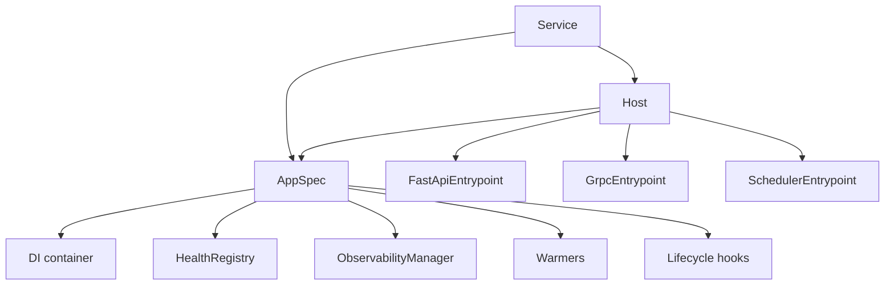
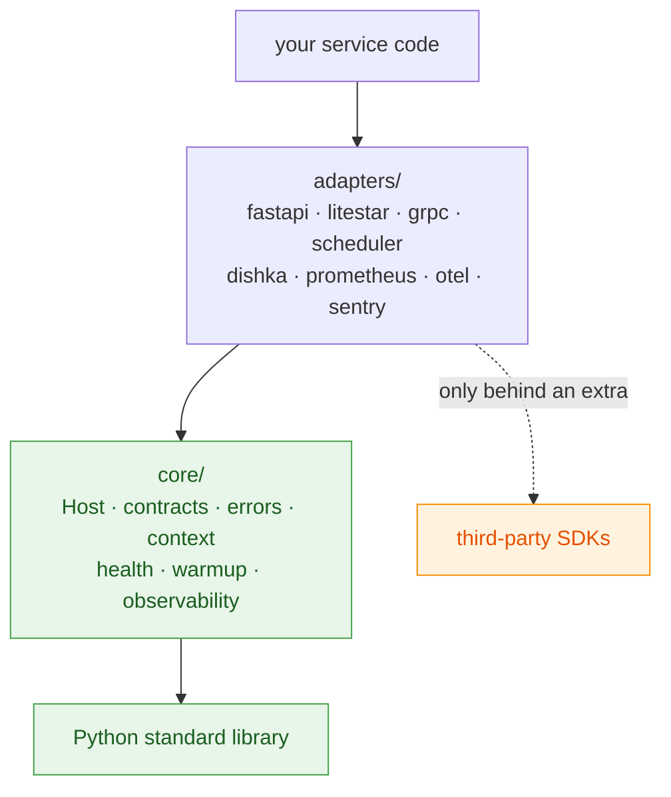

# Architecture

servicewright is built on one observation: **an HTTP request, an RPC, a cron run and a consumed
message are the same thing.** Each is one unit of work, wrapped in a fresh dependency scope, that
starts, does something and finishes.

If that is true, then "API" and "worker" are not different kinds of service. They differ only in
*what drives the work in*. So the runtime splits in two:

- the **Host** — everything that is identical: startup order, DI scopes, warmup, readiness,
  signals, drain, cleanup;
- the **Entrypoints** — the pluggable drivers: a uvicorn server, a gRPC server, a scheduler, a
  loop.

This is the model behind .NET's Generic Host, Spring's `SmartLifecycle` and go-kratos'
`transport.Server`, adapted to async Python.

## The six nouns

| Concept | What it is |
| --- | --- |
| **`Service`** | The facade you use: `Service(spec, entrypoints=[...], plugins=[...])`, then `await service.run(settings)`. |
| **`AppSpec`** | The declarative description of your service: name, container factory, lifecycle hooks, observability, warmers, health, shutdown budgets. It never mentions HTTP or gRPC. |
| **`Host`** | The kernel. Runs an `AppSpec` plus a list of entrypoints, and owns the ordering. |
| **`Entrypoint`** | A driver. Four methods: `bind`, `serve`, `drain`, `stop`. The Host treats every entrypoint identically and never asks what kind it is. |
| **`AppScope` / `UnitScope`** | The two DI tiers: process-lifetime singletons, and one unit of work. |
| **`Plugin`** | The single extension mechanism: `on_register(spec, host)` adds entrypoints, warmers, checks and hooks to a neutral spec. |

Supporting types you will meet: `ServiceContext` (what an entrypoint receives at bind time),
`Lifecycle` (four hook points), `HealthRegistry`, `AsyncWarmer`, `ObservabilityManager`.

## Two layers

The single structural rule of the codebase:

**`core/` is pure.** It imports the standard library and nothing else. No FastAPI, no grpcio, no
SQLAlchemy, no pydantic, no OpenTelemetry. It holds the contracts, the Host, the lifecycle, the
error taxonomy, the health registry, the context store and the observability orchestration.

**`adapters/` is every concrete binding.** One subpackage per framework, each behind its own
extra, each importing an SDK the core has never heard of.

The direction is enforced in CI by [import-linter](https://import-linter.readthedocs.io/) with
three contracts:

1. `core` must never import `adapters`.
2. `core` must never import any of the third-party packages by name.
3. Adapters must never import each other.

Delete the entire `adapters/` package and `core/` still imports cleanly. That is not a stylistic
preference — it is what makes `pip install servicewright` cost you nothing.

## Where things live

| Module | Responsibility | Extra |
| --- | --- | --- |
| `servicewright` | `AppSpec`, `Service`, `Host`, `run` and the public vocabulary | — |
| `core.contracts` | `Entrypoint`, `Plugin`, container / settings / health protocols | — |
| `core.aio.host` | The lifecycle kernel | — |
| `core.errors` | `ServiceError`, `ErrorKind`, the RFC 9457 renderer and its seam | — |
| `core.context` | The correlation store and outbound propagation | — |
| `core.health` | `HealthRegistry`, driving both HTTP routes and the gRPC health service | — |
| `core.warmup` | Priority-grouped, fail-fast warmup | — |
| `core.observability` | Sink protocols, null objects, the backend registry, redaction | — |
| `adapters.builtin` | `DaemonEntrypoint`, `OneShotEntrypoint` | — |
| `adapters.fastapi` | HTTP entrypoint, middleware stack, problem-details handlers | `fastapi` |
| `adapters.litestar` | Litestar HTTP entrypoint | `litestar` |
| `adapters.grpc` | gRPC entrypoint, error mapping, health bridge | `grpc` |
| `adapters.apscheduler4` / `apscheduler3` | Scheduler entrypoints with identical surfaces | `apscheduler4` / `apscheduler3` |
| `adapters.dishka` | dishka ⇄ core scope binding | `dishka` |
| `adapters.settings` | pydantic-settings models of the settings contract | `settings` |
| `adapters.observability` | Prometheus / OTel / Sentry / structlog / stdlib sinks | varies |
| `adapters.warmers`, `adapters.health` | Redis / Postgres / Kafka warmers and checks | `redis`, `postgres`, `kafka` |
| `servicewright.testing` | In-memory doubles for your own tests | — |

## What the Host does — and refuses to do

**It does:**

- configure observability first, so that failures during bootstrap are already visible;
- build the container and open the application scope;
- run warmup in priority groups, fail-fast, before anything reports ready;
- call `bind()` on each entrypoint, then flip readiness, then run every `serve()` in one
  `TaskGroup`;
- translate `SIGINT`/`SIGTERM` into a stop event;
- flip readiness off, drain and stop entrypoints in reverse order, close the app scope, flush
  telemetry;
- raise, so that a crashed service exits non-zero.

**It does not:**

- know what an HTTP request is;
- import your DI library;
- read configuration from the environment;
- decide anything based on `entrypoint.kind` — that field is a telemetry label, nothing more.

## Reading order

- **[Lifecycle](lifecycle.md)**

    The phase order, the budgets, the signal behaviour, exit codes. Read this one first.

- **[Entrypoints](entrypoints.md)**

    The four-method contract, and which base class to extend.

- **[Dependency injection](dependency-injection.md)**

    The two scope tiers and who opens them.

- **[Errors](errors.md)**

    One taxonomy that renders correctly on every transport.

Then [Settings](settings.md), [Request context](context.md), [Health](health.md),
[Warmup](warmup.md), [Observability](observability.md) and [Plugins](plugins.md) as you need them.

!!! info "Why this model and not another"

    The design was selected over a forked "api-core / worker-core" layout after a multi-framework
    study — the fork could not express "HTTP plus a scheduler in one process, one container, one
    shutdown". The full rationale, including the alternatives that were rejected, lives in
    [ARCHITECTURE.md](https://github.com/bedrock-python/servicewright/blob/master/ARCHITECTURE.md).
