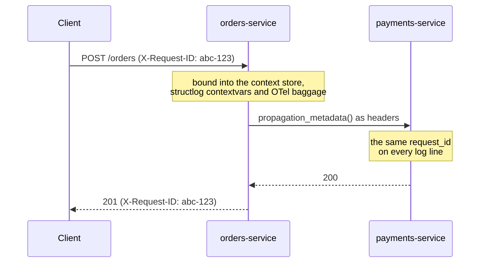

# Request context

When something goes wrong at 3am, you want to grep one identifier and see the whole story: the
request line, the three log lines your use case emitted, the Sentry event, the outbound call to
the payment provider.

servicewright keeps those identifiers in a transport-neutral store built on
`contextvars`, so any code in the async call tree can read them without having them threaded
through every function signature.



## Reading

```python
from servicewright import current_context, get_context_value

request_id = get_context_value("request_id")
user_id = get_context_value("user_id", default="anonymous")

everything = current_context()   # {"request_id": "...", "user_id": "...", ...}
```

Values are isolated per asyncio task tree, exactly like any context variable. Two concurrent
requests never see each other's ids.

## Who fills it in

You usually do not. Each transport binds the standard keys when it opens the unit scope:

| Key | Source over HTTP | Source over gRPC |
| --- | --- | --- |
| `request_id` | `X-Request-ID` header, generated if absent | `x-request-id` metadata, generated if absent |
| `user_id` | `X-User-Id` header | `x-user-id` metadata |
| `tenant_id` | `X-Tenant-Id` header | `x-tenant-id` metadata |
| `trace_id` | `X-Trace-Id` header | `x-trace-id` metadata |

The gRPC interceptor additionally binds `grpc_method`, `idempotency_key`, `client_ip` and
`user_agent`. The scheduler binds `job_id` and `run_id` as the unit-scope context.

### One owner for the request id

Over HTTP, `ContextMiddleware` is the single owner. It takes the client's `X-Request-ID` when that
value is log-safe, mints one otherwise, binds it, and **echoes it back on the response**.

So the id in your logs, the id you propagate downstream and the id the caller can quote back at
you are all the same value. That includes masked 500s: the unhandled-error layer sits *inside* the
context layer on purpose, so even a crash carries the id both on the wire and in the traceback
you logged.

### Untrusted input is validated

Correlation ids arrive from clients and end up in log files and outbound headers. servicewright
rejects anything that is empty, longer than 256 characters, or outside a log-safe alphabet
(`A-Z a-z 0-9 . _ - + = / : space`):

```python
from servicewright import is_safe_context_id

is_safe_context_id("req-42")            # True
is_safe_context_id("a\nb: injected")    # False
```

A rejected value is dropped and a fresh id is generated instead.

## Writing

For your own keys, or in code that has no transport:

```python
from servicewright import bind_context, bind_context_values, set_context_value

with bind_context(order_id="42", attempt=3):
    await process()          # both keys visible to everything inside

remove = bind_context_values({"batch_id": batch.id})
try:
    await run_batch()
finally:
    remove()

set_context_value("shard", "eu-west-1")   # returns a token you can reset
```

`None` values are skipped rather than bound.

## Propagating outbound

The chain only continues if you pass the ids along. `propagation_metadata()` collects the current
context as ready-to-send headers:

```python
from servicewright import propagation_metadata

response = await http_client.get(url, headers=propagation_metadata())
# {"x-request-id": "...", "x-user-id": "...", "x-tenant-id": "...", "x-trace-id": "..."}
```

For gRPC clients, hand the same callable to a client-side context interceptor. To propagate your
own keys, pass a mapping of `{context_key: header_name}`:

```python
propagation_metadata({"order_id": "x-order-id", "request_id": "x-request-id"})
```

The defaults live in `STANDARD_PROPAGATION_HEADERS`.

## Context setters: bridging into other systems

The store itself depends on nothing. Pushing its values into systems that keep their **own**
store is the job of `ContextSetter` plugins:

```python
class ContextSetter(Protocol):
    def set(self, context_data: dict[str, Any]) -> Callable[[], None]:
        """Set the values; return a callable that undoes it."""
```

Two ship by default and are installed automatically when their library is present:

- **`StructlogSetter`** — binds the values into structlog contextvars, so *every* log line emitted
  during the unit of work carries `request_id` without you passing it;
- **`OtelBaggageSetter`** — puts them into W3C Baggage, so OpenTelemetry-instrumented HTTP and
  gRPC clients propagate them downstream on their own.

Replace or extend them per entrypoint:

```python
class MyPlatformSetter:
    def set(self, context_data: dict) -> Callable[[], None]:
        token = my_ctx.set(context_data.get("trace_id"))
        return lambda: my_ctx.reset(token)


# FastAPI
FastApiEntrypoint(middlewares=MiddlewareConfig(context_setters=[MyPlatformSetter()]))

# gRPC
GrpcEntrypoint(config=..., servicers=..., context_setters=[MyPlatformSetter()])
```

Passing an empty list disables bridging entirely while keeping the core store. A setter that
raises is logged and never fails the request.

## Next

- [Observability](observability.md) — how these ids reach your logs and traces.
- [FastAPI adapter](../adapters/fastapi.md#middleware-stack) — where `ContextMiddleware` sits in
  the stack.
