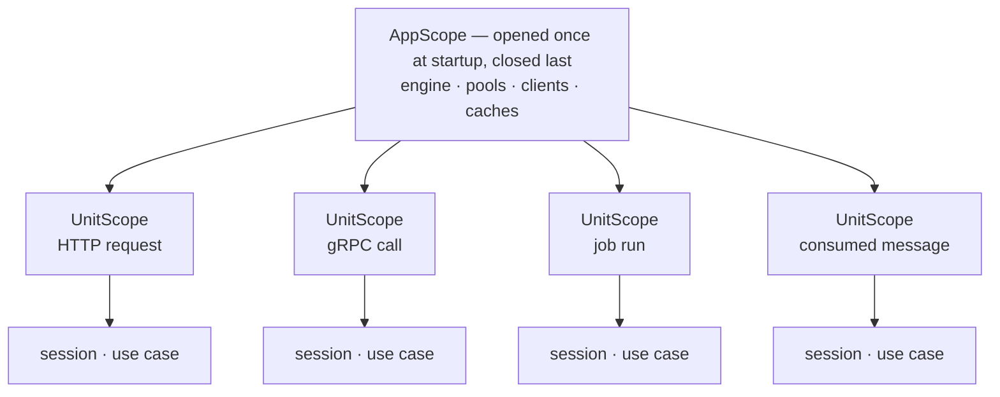

# Dependency injection

servicewright does not ship a DI container and does not depend on one. It only insists that there
are **two tiers**:

| Tier | Lives for | Holds |
| --- | --- | --- |
| **`AppScope`** | the whole process | connection pools, HTTP clients, caches, config objects |
| **`UnitScope`** | one unit of work | a database session, a use case, a transaction, a request-bound identity |

A "unit of work" is one HTTP request, one RPC, one scheduled run, one consumed message. Same tier,
same guarantees, regardless of which entrypoint produced it.



## The contract

Three protocols, all structural — no inheritance, no registration:

```python
class DependencyContainerProtocol(Protocol):
    def app_scope(self) -> AbstractAsyncContextManager[AppScopeProtocol]: ...
    def unit_scope(self, context: Mapping | None = None) -> AbstractAsyncContextManager[UnitScopeProtocol]: ...


class AppScopeProtocol(Protocol):
    async def get(self, dependency_key: type[T] | str) -> T: ...


class UnitScopeProtocol(Protocol):
    async def get(self, dependency_key: type[T] | str) -> T: ...
```

Two context managers and a `get`. That is the entire integration surface, which is why a
hand-written container fits in twenty lines:

```python
class Container:
    def __init__(self, provides: Mapping[Any, Any]) -> None:
        self._provides = dict(provides)

    @contextlib.asynccontextmanager
    async def app_scope(self) -> AsyncIterator[Scope]:
        yield Scope(self._provides)

    @contextlib.asynccontextmanager
    async def unit_scope(self, context: Mapping | None = None) -> AsyncIterator[Scope]:
        yield Scope(self._provides)
```

In practice you use [dishka](../adapters/dishka.md), where `Scope.APP` and `Scope.REQUEST` map
straight onto the two tiers.

## Who opens the unit scope

You almost never call `unit_scope()` yourself. Each entrypoint opens one at the right moment and
hands it to you:

| Entrypoint | Opened by | Once per | `context` it carries |
| --- | --- | --- | --- |
| FastAPI | `UnitScopeMiddleware` (outermost; opt out with `MiddlewareConfig(unit_scope=False)`) | request | `{"request": Request}` |
| Litestar | `UnitScopeMiddleware` (outermost; opt out with `LitestarConfig(unit_scope=False)`) | request | `{"request": Request}` |
| gRPC | `UnitScopeInterceptor` (outermost) | RPC | `grpc_method`, `request_id`, `user_id`, `tenant_id`, `trace_id`, `idempotency_key`, `client_ip`, `user_agent` |
| Scheduler | the entrypoint | job run | `{"job_id": ..., "run_id": ...}` |
| Daemon | the entrypoint | the whole loop | `None` |
| One-shot | the entrypoint | the single run | `None` |

The `context` mapping is handed to your container, which decides what to do with it — a hand-written
container might stash it, log it, or use it to pick a shard.

!!! note "dishka keys its context by **type**"

    The HTTP adapters pass `{"request": request}`, a string key, which dishka cannot resolve. If
    you want providers to depend on the incoming `Request`, see
    [the remapping recipe](../adapters/dishka.md#injecting-the-request).

## Reaching the scope from your code

=== "FastAPI"

    ```python
    from servicewright.adapters.fastapi import UnitScopeDep

    @router.get("/orders/{order_id}")
    async def get_order(order_id: str, scope: UnitScopeDep) -> dict:
        use_case = await scope.get(GetOrder)
        return await use_case.execute(order_id)
    ```

    Also available: `request.state.unit_scope`, and `current_unit_scope()` for code that has no
    access to the request object.

=== "Litestar"

    ```python
    from litestar import get
    from litestar.di import Provide

    from servicewright.adapters.litestar import get_unit_scope

    @get("/orders/{order_id:str}", dependencies={"unit_scope": Provide(get_unit_scope)})
    async def get_order(order_id: str, unit_scope: UnitScopeProtocol) -> dict:
        use_case = await unit_scope.get(GetOrder)
        return await use_case.execute(order_id)
    ```

    The entrypoint also registers `unit_scope` app-wide, so handlers can just declare the
    parameter.

=== "gRPC"

    ```python
    from servicewright.adapters.grpc import current_unit_scope

    class OrdersServicer(orders_pb2_grpc.OrdersServicer):
        async def GetOrder(self, request, context):
            scope = current_unit_scope()
            use_case = await scope.get(GetOrder)
            return await use_case.execute(request.order_id)
    ```

=== "Scheduler / daemon"

    ```python
    async def sweep_expired_orders(scope: UnitScopeProtocol) -> None:
        orders = await scope.get(OrderRepository)
        await orders.delete_expired()
    ```

    The scope is the **first argument** of the job function.

## The application scope

Opened once, closed last. Entrypoints receive it on their `ServiceContext`:

```python
async def bind(self, ctx: ServiceContext) -> None:
    pool = await ctx.app_scope.get(ConnectionPool)
```

Lifecycle hooks receive it too. Closing it is the *final* step of shutdown, after every entrypoint
has drained and stopped, which is what guarantees an in-flight request never finds its pool
already closed.

## Writing your own adapter

Implement the two context managers and you are done. Two rules:

1. **`app_scope()` must finalize on exit.** Whatever your container does to close pools and run
   finalizers has to happen when the context manager exits, because the Host relies on that as
   the last cleanup step.
2. **`unit_scope()` must be independent per call.** Entrypoints open many of them concurrently.

!!! warning "One owner per request"

    dishka, for instance, ships `setup_dishka()` for FastAPI and Litestar, which opens a request
    scope of its own. servicewright's middleware opens one too. Installing both gives you two
    scopes per request — two sessions, two transactions. Pick one: resolve through `UnitScopeDep`
    (the default), or hand the request scope to your DI integration with
    `MiddlewareConfig(unit_scope=False)` / `LitestarConfig(unit_scope=False)`. The bundled
    [dishka adapter](../adapters/dishka.md#using-dishkas-own-fastapi-or-litestar-integration)
    refuses to open a second scope on a request dishka has already scoped, so the mistake fails
    loudly rather than silently.

## Next

- [dishka adapter](../adapters/dishka.md) — the batteries-included option.
- [Entrypoints](entrypoints.md) — `ServerEntrypoint` vs `ScopedEntrypoint`, and why the split
  exists.
