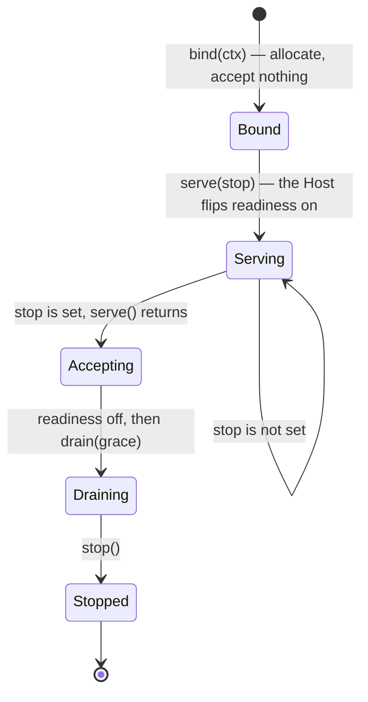

# Entrypoints

An entrypoint is **how work enters your service**. A uvicorn server, a gRPC server, an APScheduler
instance, a polling loop — each is one entrypoint, and the Host drives them all through the same
four methods.

```python
class Entrypoint(Protocol):
    kind: str
    essential: bool

    async def bind(self, ctx: ServiceContext) -> None: ...
    async def serve(self, *, stop: asyncio.Event) -> None: ...
    async def drain(self, grace: float) -> None: ...
    async def stop(self) -> None: ...
```

That is the whole contract. The Host never branches on what kind of entrypoint it is holding.

## The four methods

| Method | Called | Contract |
| --- | --- | --- |
| `bind(ctx)` | once, before readiness | Allocate, subscribe, register. **Accept nothing yet.** Raise if the resource is unavailable — the Host aborts startup instead of reporting ready. |
| `serve(stop=...)` | once, in a `TaskGroup` | Run until `stop` is set, then return **while still accepting**. Raise to report a fatal failure. |
| `drain(grace)` | on shutdown, reverse order | Stop intake. Let in-flight work finish within `grace` seconds. |
| `stop()` | after drain, reverse order | Hard stop. Release everything. Must be safe to call after `drain`. |



`bind` receives a `ServiceContext`, which is everything an entrypoint is allowed to know:

```python
ctx.settings        # your settings object
ctx.service_name    # from the AppSpec
ctx.container       # the DI container
ctx.app_scope       # the open application scope
ctx.health          # the shared HealthRegistry
ctx.observability   # the sinks: metrics, tracing, logging, error_tracking
ctx.lifecycle       # the hook registry
```

## `kind` and `essential`

```python
FastApiEntrypoint(kind="http", essential=True)
```

`kind` is a **telemetry label only**. It shows up in log records. Nothing in the Host reads it to
make a decision.

`essential` decides what happens when this entrypoint stops:

- **`essential=True`** (the default): if `serve()` raises, the exception stops the whole service
  and propagates out of `run()` — so the process exits non-zero. If `serve()` simply *returns*,
  the service shuts down gracefully. This is what makes a batch job work: it runs, it returns,
  everything stops.
- **`essential=False`**: a failure is logged, and the other entrypoints keep serving.

## Which base class to extend

There are two, and the choice is not stylistic. It is about **who opens the per-unit DI scope**.

### `ServerEntrypoint`

For socket-serving frameworks whose integration already opens a scope per request: FastAPI,
Litestar, gRPC.

It deliberately has **no** `unit_scope` method at all, so you cannot accidentally open a second
scope inside a request that already has one.

```python
from servicewright import ServerEntrypoint


class MyServerEntrypoint(ServerEntrypoint):
    kind = "http"

    async def bind(self, ctx): ...
    async def serve(self, *, stop): ...
```

### `ScopedEntrypoint`

For loop- and poll-driven work where *you* decide what one unit of work is: consumers,
schedulers, daemons, batch jobs.

It provides the only sanctioned per-unit API:

```python
from servicewright import ScopedEntrypoint


class MyConsumerEntrypoint(ScopedEntrypoint):
    kind = "nats"

    async def serve(self, *, stop):
        while not stop.is_set():
            message = await self._next_message()
            async with self.unit_scope({"subject": message.subject}) as scope:
                handler = await scope.get(MessageHandler)
                await handler.handle(message)
```

`bind()` on this base captures the container. If you override `bind`, call `super().bind(ctx)` or
`unit_scope()` will raise.

!!! danger "The double-scope footgun"

    Opening a unit scope inside a request that already has one gives you two independent
    database sessions, two transactions and a very confusing bug. Picking the right base class
    makes it structurally impossible, which is why the split exists.

## Running several at once

```python
service = Service(spec, entrypoints=[http, grpc, cron])
```

They all `bind()` in list order, all `serve()` concurrently in one `TaskGroup`, and all `drain()`
then `stop()` in **reverse** order. They share:

- one DI container and one application scope;
- one `HealthRegistry` — so a failing Postgres check turns `/readyz` **and** the gRPC health
  service red at the same moment;
- one observability stack;
- one shutdown.

There is no restriction on mixing. An HTTP API next to a Kafka consumer next to a cron job in one
process is a normal configuration, not a workaround.

## The built-in entrypoints

| Class | Base | Use for | Extra |
| --- | --- | --- | --- |
| [`FastApiEntrypoint`](../adapters/fastapi.md) | `ServerEntrypoint` | HTTP APIs | `fastapi` |
| [`LitestarEntrypoint`](../adapters/litestar.md) | `ServerEntrypoint` | HTTP APIs on Litestar | `litestar` |
| [`GrpcEntrypoint`](../adapters/grpc.md) | `ServerEntrypoint` | gRPC APIs | `grpc` |
| [`SchedulerEntrypoint`](../adapters/scheduler.md) | `ScopedEntrypoint` | cron / interval jobs | `apscheduler4` / `apscheduler3` |
| [`DaemonEntrypoint`](../adapters/daemon-and-oneshot.md) | `ScopedEntrypoint` | a long-running loop | — |
| [`OneShotEntrypoint`](../adapters/daemon-and-oneshot.md) | `ScopedEntrypoint` | a job that runs once and exits | — |

## Next

- [Write your own entrypoint](../guides/custom-entrypoint.md) — a complete worked example.
- [Dependency injection](dependency-injection.md) — what the scopes actually do.
