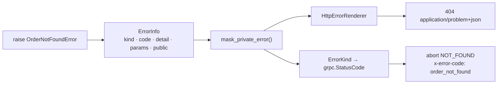

# Errors

A use case does not know which transport is calling it. But "this order does not exist" has to
become a `404` over HTTP and a `NOT_FOUND` over gRPC, with the same rule about what the client is
allowed to see.

servicewright solves that with three replaceable pieces:

- **`ServiceError`** — what your business code raises.
- **`ErrorInfo`** — the normalized view of any failure, built by the transport handler.
- **`HttpErrorRendererProtocol`** — turns an `ErrorInfo` into a wire response.



## Raise a typed error

```python
from servicewright import ErrorKind, ServiceError


class OrderNotFoundError(ServiceError):
    kind = ErrorKind.NOT_FOUND      # code auto-derives to "order_not_found"


raise OrderNotFoundError("no such order", params={"order_id": order_id})
```

Subclassing is the normal path: the class name becomes the machine-readable code
(`OrderNotFoundError` → `order_not_found`), and the kind decides the status.

You can also raise the base class directly:

```python
raise ServiceError("quota exceeded", kind=ErrorKind.TOO_MANY_REQUESTS, code="quota_exceeded")
```

Every attribute is resolved onto the instance, so catching works the way you would expect:

```python
except ServiceError as exc:
    if exc.code == "order_not_found":   # the resolved code, not the class default
        ...
```

## The kinds

| `ErrorKind` | HTTP | gRPC |
| --- | --- | --- |
| `INVALID` | 400 | `INVALID_ARGUMENT` |
| `UNAUTHENTICATED` | 401 | `UNAUTHENTICATED` |
| `FORBIDDEN` | 403 | `PERMISSION_DENIED` |
| `NOT_FOUND` | 404 | `NOT_FOUND` |
| `CONFLICT` | 409 | `ALREADY_EXISTS` |
| `PRECONDITION_FAILED` | 412 | `FAILED_PRECONDITION` |
| `TOO_MANY_REQUESTS` | 429 | `RESOURCE_EXHAUSTED` |
| `NOT_IMPLEMENTED` | 501 | `UNIMPLEMENTED` |
| `UNAVAILABLE` | 503 | `UNAVAILABLE` |
| `DEADLINE_EXCEEDED` | 504 | `DEADLINE_EXCEEDED` |
| `INTERNAL` | 500 | `INTERNAL` |

## What the client sees

Over HTTP, an RFC 9457 problem document with `Content-Type: application/problem+json`:

```json
{
  "type": "about:blank",
  "title": "Not Found",
  "status": 404,
  "code": "order_not_found",
  "detail": "no such order",
  "params": { "order_id": "42" }
}
```

Over gRPC, the RPC aborts with `NOT_FOUND`, the detail becomes the status message, and the machine
code travels in the `x-error-code` trailing metadata so clients can branch without parsing
English.

## Public and private errors

```python
raise ServiceError(
    "row 412 violates fk_orders_user",
    kind=ErrorKind.CONFLICT,
    public=False,
)
```

`public=False` masks the error on **every** transport. The client gets a generic internal error;
the real code, detail and params go to your logs only.

Masking strips *everything* — detail, params, extra headers, any status override — so nothing can
leak through a custom renderer by accident.

!!! tip

    Make it a class attribute for whole families of errors:

    ```python
    class InfrastructureError(ServiceError):
        kind = ErrorKind.INTERNAL
        public = False
    ```

## Own the wire format

If your product has its own error envelope, implement one renderer and every default handler
starts speaking it:

```python
from servicewright import ErrorInfo, RenderedError


class MyEnvelopeRenderer:
    def render(self, info: ErrorInfo) -> RenderedError:
        return RenderedError(
            status_code=info.http_status,
            body={"error": {"code": info.code, "message": self._localize(info)}},
            media_type="application/json",
        )


http = FastApiEntrypoint(error_renderer=MyEnvelopeRenderer())
```

`ErrorInfo` gives you everything you need to localize: `kind`, `code`, `detail`, `params`,
`public`, `status_override`, `headers` and the computed `http_status`.

The default renderer can also be pointed at a documentation base URI:

```python
from servicewright import ProblemDetailsRenderer

FastApiEntrypoint(error_renderer=ProblemDetailsRenderer(type_base="https://errors.example.com"))
# → "type": "https://errors.example.com/order_not_found"
```

### Rendering never fails

Rendering an error is the client's last chance to learn what went wrong, so it may not be the
thing that breaks:

- `params` that are not JSON primitives — a `UUID`, a `datetime`, a `Decimal`, a set, a
  self-referencing dict — are coerced, not dropped and not raised on;
- non-finite floats (`nan`, `inf`) become strings, because `json.dumps` rejects them;
- a status outside the IANA registry (499, 520) still gets a sensible title.

The two helpers doing that are public, if your renderer wants them:

```python
from servicewright.core.errors import status_title, to_json_safe
```

## The default HTTP handlers

`FastApiEntrypoint` installs five, all rendering through the configured renderer:

| Situation | Result |
| --- | --- |
| Request validation failed | 422, `code="validation_error"`, sanitized field errors |
| `HTTPException` with a 4xx status | that status, detail and headers preserved |
| `HTTPException` with a 5xx status | masked to a generic internal error |
| `ServiceError` | its kind's status; masked when `public=False` |
| Deadline exceeded | 504, `code="deadline_exceeded"` |
| Anything unhandled | masked 500, logged with the request id — and the response carries that id too |

Add handlers for your own exception types, or switch the defaults off entirely:

```python
FastApiEntrypoint(
    exception_handlers={MyLegacyError: my_handler},
    default_exception_handlers=False,
)
```

## Runtime errors

Failures of the runtime itself have their own family, all deriving from `ServiceWrightError`:

| Exception | Raised when |
| --- | --- |
| `WarmupError` | a warmer failed and `raise_on_failure` was set |
| `WarmupTimeoutError` | warmup did not finish in its 60-second budget |
| `DrainTimeoutError` | an entrypoint did not drain within its grace window |
| `CleanupTimeoutError` | a post-drain step blew its budget |
| `RedisWarmupError`, `PostgresWarmupError`, `KafkaProducerWarmupError` | the matching warmer failed |

These are `TimeoutError` subclasses where that makes sense, so ordinary `except TimeoutError`
still catches them.

## Next

- [FastAPI adapter](../adapters/fastapi.md#error-handling) — where the handlers are installed.
- [gRPC adapter](../adapters/grpc.md#error-mapping) — interceptor ordering and why it matters.
