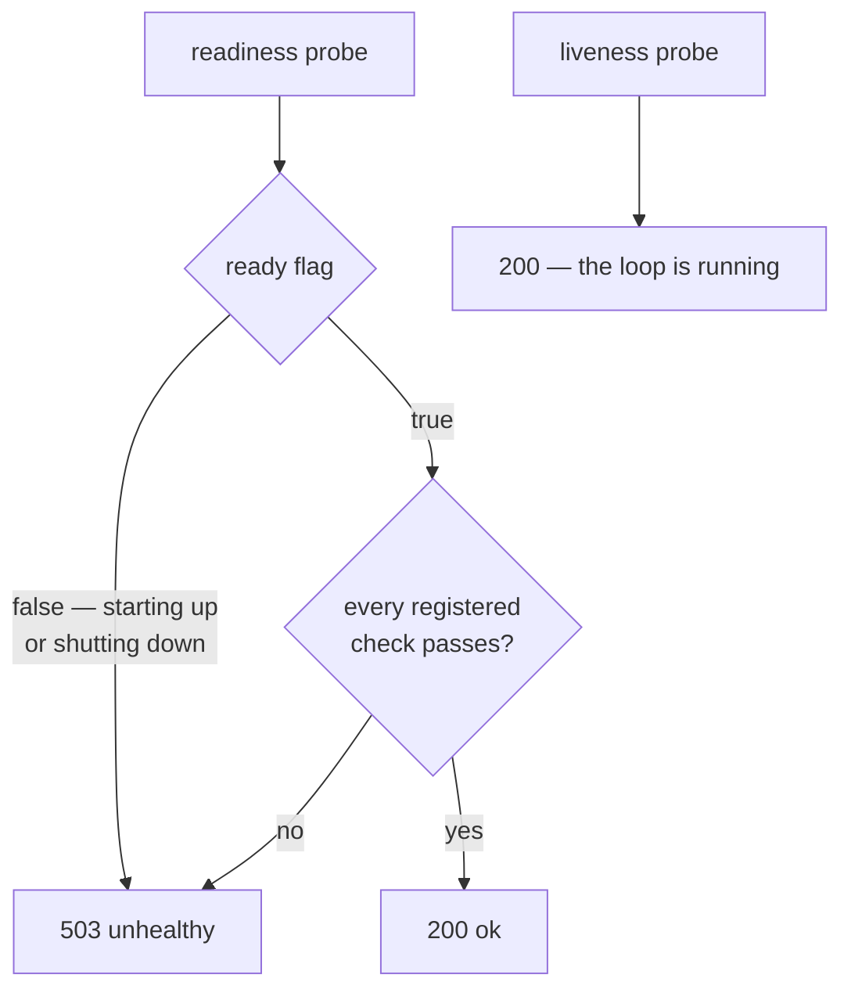

# Health checks

One `HealthRegistry` per service answers two different questions:

| Probe | Question | Answer |
| --- | --- | --- |
| **Liveness** | Is this process alive? | Always healthy while the event loop runs. |
| **Readiness** | Should traffic be routed here? | The `ready` flag **and** every registered check passing. |

Keeping them separate matters. If liveness depended on your database, a Postgres blip would make
Kubernetes *restart* every pod instead of just routing around them.



## The `ready` flag

The Host owns it:

- flipped **on** after warmup, after `bind()`, after `pre_start` hooks — the last step before
  `post_start`;
- flipped **off** as the very first step of shutdown, *before* anything stops accepting.

That is what makes a rolling deploy lossless: the load balancer removes the pod while it can
still serve, and only then does the drain begin.

## Registering checks

```python
from servicewright import AppSpec

spec = AppSpec(service_name="orders", create_container=build_container)

spec.health.add_check("postgres", PostgresHealthCheck(session_maker))
spec.health.add_check("redis", RedisHealthCheck(redis_client))
```

A check is anything with one method:

```python
class HealthCheckerProtocol(Protocol):
    async def check(self) -> bool: ...
```

So your own is trivial:

```python
class PaymentGatewayCheck:
    def __init__(self, client: PaymentClient) -> None:
        self._client = client

    async def check(self) -> bool:
        return await self._client.ping()
```

Checks run **concurrently** on every readiness probe. A check that raises counts as a failure and
is logged with its name — it never propagates. Names must be unique; registering a duplicate
raises `ValueError`.

Two checks ship in the box: [`PostgresHealthCheck` and `RedisHealthCheck`](../adapters/infrastructure.md).

## Reading the result

```python
report = await spec.health.readiness()

report.healthy      # bool
report.checks       # {"postgres": True, "redis": False}
report.status       # ProbeStatus.UNHEALTHY
```

## Caching

If your checks are expensive and your probe interval is aggressive, cache the verdict:

```python
from servicewright import AppSpec, HealthRegistry

spec = AppSpec(
    service_name="orders",
    create_container=build_container,
    health=HealthRegistry(readiness_cache_ttl=2.0),
)
```

With a TTL of `0.0` (the default) every probe runs every check.

## One registry, every transport

The same registry drives all of these — there is nothing to keep in sync:

=== "HTTP (FastAPI)"

    ```
    GET /system/health/livez    → 200 {"status": "ok"}
    GET /system/health/readyz   → 200 {"status": "ok"}
                                → 503 {"status": "unhealthy"}
    ```

    Paths are configurable via `HttpConfig(health=HealthConfig(...))`, and the routes can be
    switched off entirely with `HealthConfig(enabled=False)`.

=== "HTTP (Litestar)"

    ```
    GET /system/livez
    GET /system/readyz
    ```

    Note the shorter paths — the Litestar binding uses its own defaults.

=== "gRPC"

    The standard `grpc.health.v1.Health` service reports `SERVING` exactly while readiness is
    healthy.

    Because that service is a *push* API, the entrypoint polls the registry every
    `health_refresh_interval` seconds (5 by default) while serving, so a dependency failing
    mid-life flips the health status within roughly one interval.

    ```yaml
    readinessProbe:
      grpc:
        port: 50051
    ```

## What a failing check does — and does not do

A failing check makes readiness unhealthy. That is all:

- `/readyz` returns 503 and the gRPC health service says `NOT_SERVING`, so load balancers stop
  sending new work;
- the process keeps running, keeps serving in-flight work, and keeps re-checking;
- nothing restarts, because liveness is unaffected.

If you want a hard failure at startup instead, use a [warmer](warmup.md) — those are fail-fast by
design.

## Next

- [Warmup](warmup.md) — the fail-fast counterpart that runs *before* readiness.
- [Kubernetes](../operations/kubernetes.md) — probe configuration that matches this behaviour.
