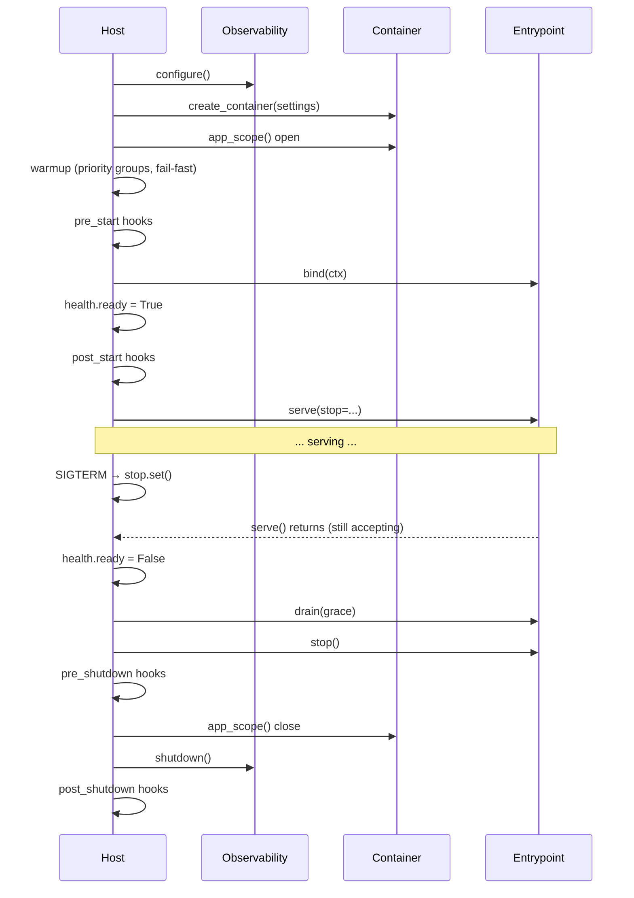

# Lifecycle

Every service runs the same sequence, whether it serves HTTP, consumes Kafka or runs once and
exits:

```
Bootstrap → Warmup → Ready → Serve → Drain → Cleanup
```

The value is in the *ordering*. Getting it wrong is how you drop requests during a deploy.

## Startup

1. **Observability is configured first.** Logging, error tracking, tracing and metrics are set up
   before anything else, so a failure two steps later is already visible.
2. **The container is built** — `create_container(settings)` — and the **application scope** is
   opened.
3. **Warmup** runs in priority groups, fail-fast. Connection pools get primed here.
4. **`pre_start` hooks** run.
5. **`bind()`** is called on each entrypoint in order. Sockets open, topics subscribe, schedules
   register. Nothing is accepted yet.
6. **`health.ready = True`**, then **`post_start` hooks**.
7. Every `serve(stop=...)` runs concurrently in one `asyncio.TaskGroup`.

Anything that raises in steps 2–6 aborts startup. The service then goes straight to cleanup,
tearing down whatever was already bound, and the exception propagates out of `run()`.

!!! info "Why the socket opens in `bind()`, not `serve()`"

    A port clash must fail *loudly during startup*, while readiness is still `false` — not leave
    you with a process that reports healthy and serves nothing. Opening the listener in `bind()`
    also makes `port=0` useful: the entrypoint's `bound_port` tells you what the OS picked.

### Startup is stop-aware

A `SIGTERM` that arrives mid-startup is honoured at the next phase boundary. Kubernetes routinely
terminates a pod that is still warming up, and that pod must never bind ports or announce itself
ready:

```
SIGTERM during a 45-second Kafka warmup
  → the warmup is abandoned
  → bind() is skipped
  → readiness stays false
  → the process goes straight to cleanup
```

## Serve

`serve(stop=...)` runs until the `stop` event is set, then **returns while still accepting work**.

That last part is deliberate and easy to get wrong. Returning from `serve()` means "I am still
open for business and ready to be torn down in order". The Host then flips readiness off and only
*after* that calls `drain()`, which is what actually closes the listener.

If the HTTP entrypoint shut uvicorn down inside `serve()` instead, the readiness endpoint would
die before the load balancer noticed, and the drain window would be meaningless.

## Shutdown

1. **`health.ready = False` first.** Load balancers stop routing before you stop accepting.
2. **`drain(grace)`** on every bound entrypoint, in **reverse** bind order. Intake stops;
   in-flight work finishes inside the window.
3. **`stop()`** on every bound entrypoint, in reverse order. Hard stop, time-boxed.
4. **`pre_shutdown` hooks** — the application scope is still alive here. Flush the outbox, emit
   final events.
5. **The application scope closes.** Your DI finalizers close pools and clients.
6. **Observability flushes** (spans, Sentry events, the metrics server thread), then
   **`post_shutdown` hooks** run.

Only entrypoints that were actually bound are drained and stopped, and a step that fails is
logged and skipped so the remaining entrypoints still get their turn. One entrypoint hanging in
`stop()` can never block the others.

## Budgets

```python
spec = AppSpec(
    service_name="orders",
    create_container=build_container,
    drain_grace_seconds=30.0,      # per entrypoint, for in-flight work
    cleanup_timeout_seconds=10.0,  # per post-drain step
)
```

| Step | Budget | On overrun |
| --- | --- | --- |
| Warmup (whole phase) | 60s, fixed | `WarmupTimeoutError`, startup aborts |
| `drain(grace)` | `drain_grace_seconds` + 5s | `DrainTimeoutError` |
| `stop()` | `cleanup_timeout_seconds` | `CleanupTimeoutError` |
| `pre_shutdown` hooks | `cleanup_timeout_seconds` | `CleanupTimeoutError` |
| Observability flush | `cleanup_timeout_seconds` | `CleanupTimeoutError` |
| `post_shutdown` hooks | `cleanup_timeout_seconds` | `CleanupTimeoutError` |

The extra 5 seconds on the drain step exist so an entrypoint that honours its own grace window
exactly is not killed a millisecond too early.

A timeout is logged and then surfaced from `run()` — but only if nothing else is already
propagating. A shutdown that blew its budget must never mask the failure that caused the shutdown
in the first place.

!!! tip "Match `drain_grace_seconds` to Kubernetes"

    Keep `terminationGracePeriodSeconds` larger than `drain_grace_seconds + cleanup_timeout_seconds`,
    otherwise the kubelet sends `SIGKILL` in the middle of your drain. See
    [Kubernetes](../operations/kubernetes.md).

## Event loop

The Host runs on whatever loop it is started in; it never creates one. `run_sync` is the entry
point that does, through `asyncio.run(..., loop_factory=...)`:

```python
from servicewright import run_sync

if __name__ == "__main__":
    run_sync(service, settings)                  # loop="auto": uvloop when installed, asyncio otherwise
    run_sync(service, settings, loop="uvloop")   # uvloop, or an ImportError naming the extra
    run_sync(service, settings, loop="asyncio")  # asyncio's default loop, whatever is installed
```

`pip install "servicewright[uvloop]"` brings uvloop in on its own; the `fastapi` and `litestar`
extras already carry it through `uvicorn[standard]`, but nothing switches to it until `run_sync`
does — uvicorn's own `loop=` option never applies here, because the entrypoints drive uvicorn
inside the Host's loop. No event loop policy is installed (they are deprecated in Python 3.14).

Embedding — a test, a custom runner — keeps `asyncio.run(service.run(settings))` or any loop of
its own; `event_loop_factory("auto")` returns the factory `run_sync` would have used.

The readiness line says which loop the service actually runs on:

```
Service ready  service=orders event_loop=uvloop.Loop
```

## Signals

The first `SIGINT` or `SIGTERM` sets the stop event and starts the graceful sequence above.

A **second** signal exits immediately with `128 + signum`. Cleanup can hang — a dead connection
pool, a stuck `stop()` — and an operator pressing ++ctrl+c++ twice is asking for the process to
die now, not to re-set an event that is already set.

Handlers are removed when the run loop ends, so an embedded service never leaves them pointing at
a closed event loop.

If you pass your own stop event, servicewright installs **no** handlers at all:

```python
stop = asyncio.Event()
await service.run(settings, stop=stop)   # you own the signals
```

This is the embedding path, and the one tests use.

## Exit codes

A crash must not look like a graceful stop:

| What happened | Result |
| --- | --- |
| Clean stop | `run()` returns `None`, process exits `0` |
| An **essential** entrypoint's `serve()` raised | the exception propagates out of `run()` after cleanup |
| An essential entrypoint's `serve()` returned early | the whole service stops gracefully |
| A **non-essential** entrypoint failed | logged; the rest keep serving |
| Startup failed | that exception propagates after cleanup |
| Second `SIGTERM` | immediate exit, code `128 + signum` |

That is why `essential` exists: a batch job that died mid-run must exit non-zero so Kubernetes
retries it, while a metrics sidecar entrypoint dying should not take the API down.

## Hooks

Four extension points, all optional:

```python
spec.lifecycle.add_pre_start_hook(migrate_database)     # before bind
spec.lifecycle.add_post_start_hook(announce_ready)      # after readiness flips on
spec.lifecycle.add_pre_shutdown_hook(flush_outbox)      # app scope still open
spec.lifecycle.add_post_shutdown_hook(final_report)     # after the scope closed
```

A hook is an async callable. It may take the application scope, or take nothing:

```python
async def migrate_database(app_scope: AppScopeProtocol | None = None) -> None:
    migrator = await app_scope.get(Migrator)
    await migrator.run()


async def announce_ready() -> None:      # no arguments is fine too
    ...
```

**Start hooks are fail-fast**: one that raises aborts startup.
**Shutdown hooks are best-effort**: one that raises is logged, and the rest still run.

!!! note

    `post_shutdown` hooks run after the application scope has closed, so they receive `None`
    instead of a scope. Do not resolve dependencies there.

## The whole thing, in order


