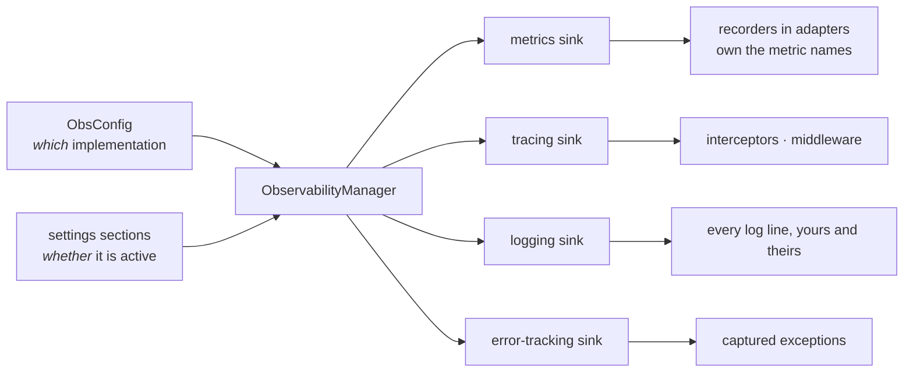

# Observability

Four concerns — **metrics**, **tracing**, **logging**, **error tracking** — are protocols in the
kernel with pluggable, extra-gated backends behind them.

`import servicewright` pays for none of it. A backend module is imported only when you have
selected it *and* configured it.

## Selecting backends

```python
from servicewright import AppSpec, KeyRedactor, ObsConfig, ObservabilityManager

spec = AppSpec(
    service_name="orders",
    create_container=build_container,
    observability=ObservabilityManager(
        ObsConfig(
            metrics="prometheus",
            tracing="otel",
            error_tracking="sentry",
            logging="structlog",
        ),
        redactor=KeyRedactor(),
    ),
)
```

| Concern | Built-in backends | Extra |
| --- | --- | --- |
| `metrics` | `prometheus` | `metrics` |
| `tracing` | `otel` | `observability` (+ `fastapi-tracing` for HTTP spans) |
| `error_tracking` | `sentry` | `sentry` |
| `logging` | `structlog`, `stdlib` | `observability`, — |

Backend names are open strings. Anything you [register](#third-party-backends) is selectable the
same way.



## Selection is not activation

This trips people up once, so it is worth being explicit:

- **`ObsConfig` says which implementation to use** *if* the concern is configured.
- **Your settings decide whether it is active.**

```python
ObsConfig(error_tracking="sentry")   # "when error tracking is on, use Sentry"
settings.error_tracking = None       # "it is off"   → nothing is imported
```

The gates are:

| Concern | Active when |
| --- | --- |
| logging | `settings.logging is not None` |
| error tracking | `settings.error_tracking` exists **and** has a non-empty `dsn` |
| tracing | `settings.tracing is not None` |
| metrics | `settings.metrics is not None` |

!!! note "The default manager selects nothing"

    `ObservabilityManager()` with no `ObsConfig` disables everything — a bare `AppSpec` runs with
    zero observability side effects. `ObsConfig()` on its own, however, defaults to
    `prometheus` / `otel` / `sentry` / `structlog`. Pass it explicitly when you want them.

## How it degrades

| Situation | Result |
| --- | --- |
| Selected, configured, extra installed | the backend runs |
| Selected, configured, **extra missing** | `ImportError` at bootstrap, naming the extra to install |
| Selected, **not** configured | null object, calls do nothing |
| Not selected | null object |
| Unknown backend name | `ValueError` listing the registered backends |

Emitters therefore never see `None` and never have to check. `ctx.observability.metrics.counter(...)`
is always safe to call.

## Instance injection

If you would rather not go through the registry — a backend that needs constructor arguments, or
a test double — pass a ready instance. It wins over the config name, and it is unconditional: its
own `setup()` decides what to do with the settings.

```python
ObservabilityManager(metrics=StatsdMetricsSink(host="127.0.0.1"))
```

## Third-party backends

A backend is one module plus one registration. No kernel change:

```python
from servicewright import register_sink

register_sink("metrics", "statsd", "myapp.observability:StatsdMetricsSink")
# then: ObsConfig(metrics="statsd")
```

The target is imported lazily, so registering costs nothing until the backend is selected. See
[Observability backends](../adapters/observability-backends.md) for the ABCs to subclass.

## Metrics are instruments, not metric names

Backends mint counters and histograms. They know nothing about HTTP or gRPC.

Metric **names** live with their owner — the transport adapter that records them:

```python
recorder = GrpcServerMetricsRecorder(ctx.observability.metrics)   # owns grpc_requests_total
```

That inversion is what keeps the matrix from exploding: a new backend automatically serves every
transport, and a new transport automatically serves every backend.

Prometheus instruments are cached **per registry**, so a second service in the same process reuses
the existing collectors instead of failing with a duplicate-timeseries error.

## Logging

The logging sink owns the destination, level and format of **every** line, including the HTTP
adapter's own request logs. Those go *through* the standard library logger, not around it, so
`settings.logging.level` filters them and `use_json` formats them like everything else.

With the logging concern switched off, the root logger is left untouched and request lines follow
whatever your application configured.

Correlation is automatic: the transports bind `request_id` / `user_id` / `tenant_id` / `trace_id`
into the [context store](context.md) and push them into structlog contextvars and OTel Baggage.

## Redaction

`KeyRedactor` masks values whose key contains a sensitive fragment, and it is threaded into
**both** the logging and error-tracking sinks:

```python
KeyRedactor(sensitive_keys={"password", "api_key", "ssn"}, mask="[REDACTED]")
```

It walks the whole structure — nested dicts *and* values inside lists. That matters more than it
sounds: a Sentry event keeps stack-frame locals under
`exception.values[i].stacktrace.frames[j].vars` and breadcrumb payloads under
`breadcrumbs.values[i].data`. A redactor that only recursed into dicts would mask the tidy `extra`
block and ship your credentials in the frame locals.

Any callable `dict -> dict` works in its place.

## Lifecycle

Observability is configured **first**, before the container exists, so bootstrap failures are
already observable. It is shut down **last**, off the event loop and under a budget, so flushing
spans or joining the metrics server thread can never block the final steps.

`shutdown()` returns the manager to its pre-configure state. A `Service` reuses one long-lived
`AppSpec`, so a second run in the same process gets a live stack again rather than a silently dead
one.

!!! warning "SDK setup happens before the DI container"

    Sinks are set up during bootstrap, so anything they need — a DSN, a collector URL, a token —
    must be reachable from `settings`. A secret resolved through the container is not available
    yet at that point.

## Next

- [Observability backends](../adapters/observability-backends.md) — what each built-in backend
  does, and how to write your own.
- [Settings](settings.md) — the shape of each section.
