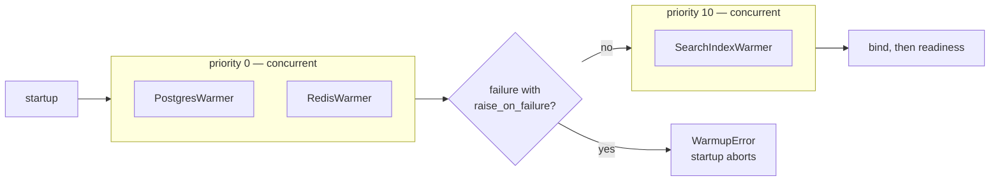

# Warmup

A freshly started process has a cold connection pool. The first requests after a deploy pay for
the TCP handshakes, the TLS negotiation and the auth round-trip — exactly when a rolling update
has just sent them your way.

Warmup runs **before readiness flips on**, so that cost is paid while no traffic is arriving. It
is also the natural place to fail fast: a bad database URL should kill the pod at startup, not
surface as a 500 five minutes later.

## Writing a warmer

```python
from servicewright import AsyncWarmer


class SearchIndexWarmer(AsyncWarmer):
    def __init__(self, client: SearchClient) -> None:
        super().__init__(raise_on_failure=True)
        self._client = client

    @property
    def priority(self) -> int:
        return 10

    async def warmup(self) -> None:
        await self._client.load_index()
```

Two knobs:

`priority`
:   Lower runs earlier. Warmers with the **same** priority run **in parallel**. Default `0`.

`raise_on_failure`
:   `True` (default) means a failure aborts startup. `False` means it is logged as a warning and
    the service starts anyway — right for a cache you can live without.

## Registering

```python
spec = AppSpec(
    service_name="orders",
    create_container=build_container,
    warmers=[PostgresWarmer(session_manager), RedisWarmer(redis_client)],
)
```

Or append later — a plugin does exactly this:

```python
spec.warmers.append(SearchIndexWarmer(client))
```

When a warmer needs a dependency, use the factory instead. It receives the `ServiceContext`, so
the application scope is already open, and it may be async:

```python
async def build_warmers(ctx: ServiceContext) -> list[AsyncWarmer]:
    pool = await ctx.app_scope.get(ConnectionPool)
    return [PoolWarmer(pool)]


spec = AppSpec(
    service_name="orders",
    create_container=build_container,
    warmers_factory=build_warmers,
)
```

Warmers from `warmers` and from `warmers_factory` are merged into one list.

## How a run goes

1. Warmers are grouped by priority, ascending.
2. Each group runs concurrently. A failure inside a group does **not** cancel its siblings — they
   all get to finish.
3. After a group, if anything failed with `raise_on_failure=True`, warmup stops and startup aborts
   with `WarmupError`.
4. Otherwise the next group runs.

```python
warmers=[
    PostgresWarmer(db, priority=0),      # ─┐ run together
    RedisWarmer(cache, priority=0),      # ─┘
    SearchIndexWarmer(search, priority=10),   # only after both succeeded
]
```



## Budgets and signals

The whole phase is bounded by a **60-second** budget. Exceeding it raises `WarmupTimeoutError` and
aborts startup. Individual warmers usually carry their own, tighter timeout — the built-in ones
default to 10 seconds.

Warmup is also stop-aware. A `SIGTERM` arriving mid-warmup abandons the wait, skips `bind()`
entirely and goes straight to cleanup. A pod that has already been told to terminate must never
open a port.

## Built-in warmers

| Warmer | Does | Extra |
| --- | --- | --- |
| `PostgresWarmer` | runs `SELECT 1` through a SQLAlchemy session manager | `postgres` |
| `RedisWarmer` | fires concurrent `PING`s to fill the pool | `redis` |
| `KafkaProducerWarmer` | fetches cluster metadata through the producer | `kafka` |

See [Infrastructure adapters](../adapters/infrastructure.md) for their arguments.

## Warmup or health check?

Both talk to the same dependencies, and they answer different questions.

| | Warmup | Health check |
| --- | --- | --- |
| Runs | once, at startup | on every readiness probe |
| Failure means | the process does not start | traffic is routed elsewhere |
| Good for | bad config, unreachable database, cold pools | transient outages, dependency degradation |

Most services register both, against the same client.

## Next

- [Health checks](health.md) — the continuous counterpart.
- [Lifecycle](lifecycle.md) — where warmup sits in the startup order.
