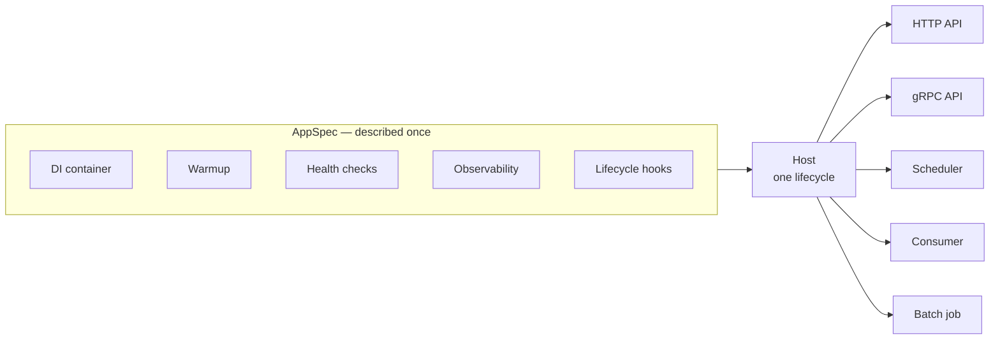

# servicewright

<p style="font-size: 1.15rem; opacity: 0.85; margin-top: -0.6rem;">
One <code>Host</code>, many <code>Entrypoint</code>s — a batteries-optional microservice runtime for async Python.
</p>

[](https://pypi.org/project/servicewright/)
[](https://pypi.org/project/servicewright/)
[](https://github.com/bedrock-python/servicewright/actions/workflows/ci.yml)
[](https://github.com/bedrock-python/servicewright/blob/master/LICENSE)

You describe a service **once** — its name, its DI container, its lifecycle hooks, its warmup,
its health checks, its observability. Then you run it through any number of **entrypoints**:
an HTTP API, a gRPC server, a cron scheduler, a background daemon, a one-shot batch job.

All of them share one startup sequence, one dependency container and one graceful shutdown.

```python
service = Service(spec, entrypoints=[http, grpc, cron])
await service.run(settings)
```

That is the whole idea. An HTTP API and a cron job are not different kinds of program here —
they are the same program with different drivers plugged into the front.



## Install

```bash
pip install servicewright
```

The bare install has **zero dependencies**. Every framework binding lives behind an extra:

```bash
pip install "servicewright[fastapi]"       # HTTP entrypoint
pip install "servicewright[grpc]"          # gRPC entrypoint
pip install "servicewright[apscheduler4]"  # scheduler entrypoint
```

Python 3.12+. See [Installation](getting-started/installation.md) for the full list of extras.

## A first taste

```python
from servicewright import AppSpec, Service, run_sync
from servicewright.adapters.fastapi import FastApiEntrypoint, HttpConfig


spec = AppSpec(
    service_name="orders",
    create_container=build_container,   # your DI container
)

service = Service(spec, entrypoints=[
    FastApiEntrypoint(config=HttpConfig(port=8000), routers=(router,)),
])

run_sync(service, settings)
```

You now have a service that:

- opens the application DI scope, primes its connection pools, **then** reports itself ready;
- serves `/system/health/livez` and `/system/health/readyz` for Kubernetes;
- opens a fresh DI scope around every request;
- on `SIGTERM` flips readiness to `false` **first**, drains in-flight requests, closes the pools
  last, and exits `0` — or non-zero if it actually crashed.

Add a second entrypoint to the list and it joins the same lifecycle. Nothing else changes.

## Why

**One lifecycle for every archetype.**
`Bootstrap → Warmup → Ready → Serve → Drain → Cleanup`. The ordering is the part that is hard to
get right by hand, and it is the same ordering whether you are serving HTTP or sweeping a queue.
See [Lifecycle](concepts/lifecycle.md).

**No DI library in the core.**
The kernel knows two things about dependency injection: there is an *application* scope and a
*unit-of-work* scope. A [dishka](adapters/dishka.md) adapter ships in the box; any other container
fits by implementing two methods.

**Errors that render on every transport.**
Raise `ServiceError(kind=ErrorKind.NOT_FOUND)` in a use case. It becomes an RFC 9457
`application/problem+json` 404 over HTTP and a `NOT_FOUND` abort over gRPC, with one rule for what
the client is allowed to see. See [Errors](concepts/errors.md).

**Observability you select, not inherit.**
Metrics, tracing, logging and error tracking are four protocols with pluggable backends
(Prometheus, OpenTelemetry, Sentry, structlog). Pick per concern, or plug in your own.
See [Observability](concepts/observability.md).

**Nothing you did not ask for.**
`import servicewright` imports the standard library and nothing else. A CI contract enforces it:
delete the whole `adapters/` package and `core/` still imports.

## What's in the box

| You want to run | Use | Extra |
| --- | --- | --- |
| An HTTP API | [`FastApiEntrypoint`](adapters/fastapi.md) | `fastapi` |
| An HTTP API on Litestar | [`LitestarEntrypoint`](adapters/litestar.md) | `litestar` |
| A gRPC API | [`GrpcEntrypoint`](adapters/grpc.md) | `grpc` |
| Scheduled / cron jobs | [`SchedulerEntrypoint`](adapters/scheduler.md) | `apscheduler4` or `apscheduler3` |
| A long-running loop | [`DaemonEntrypoint`](adapters/daemon-and-oneshot.md) | — |
| A batch job that exits | [`OneShotEntrypoint`](adapters/daemon-and-oneshot.md) | — |
| Something else entirely | [Write your own](guides/custom-entrypoint.md) | — |

## Where to go next

<div class="grid cards" markdown>

- **New here?**

    Start with [Your first service](getting-started/first-service.md) — a complete service in
    40 lines with no dependencies at all.

- **Building something real?**

    The [tutorial](getting-started/tutorial.md) walks through an HTTP API and a cron job living
    in one process, with dishka and Prometheus wired in.

- **Want the model?**

    [Architecture](concepts/architecture.md) explains the six nouns and why the core imports nothing.

- **Starting a real service?**

    [Blueprints](blueprints/project-layout.md) are copy-paste skeletons: project layout, HTTP API,
    gRPC, worker, batch job.

- **Already running one?**

    The [production checklist](operations/checklist.md) and the
    [runbooks](operations/runbooks.md) cover what breaks and why.

- **Looking up an argument?**

    The [API reference](reference/servicewright.md) is generated from the source.

</div>
