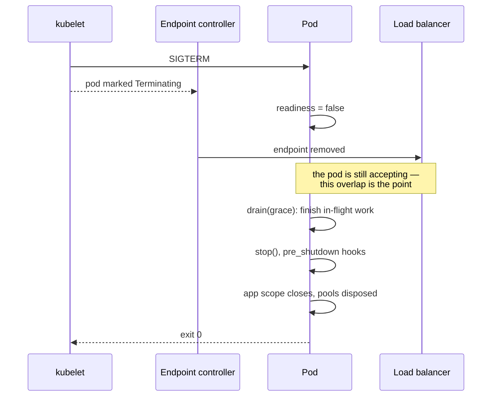

# Kubernetes

servicewright's shutdown ordering was designed against how Kubernetes actually terminates pods.
This page is the configuration that matches it.

## What happens on a rollout

When the kubelet terminates a pod, two things happen **concurrently**:

1. the endpoint is removed from Services (eventually — it propagates asynchronously);
2. `SIGTERM` is sent to your process.

That race is why a service must keep serving *after* it has been told to stop. servicewright does:
readiness flips to `false` first, so the endpoint controller starts removing you, and only then
does the drain begin.



## Probes

```yaml
livenessProbe:
  httpGet:
    path: /system/health/livez
    port: 8000
  periodSeconds: 10
  failureThreshold: 3

readinessProbe:
  httpGet:
    path: /system/health/readyz
    port: 8000
  periodSeconds: 5
  failureThreshold: 2
```

Liveness is independent of your dependencies — it only says the event loop is alive. Pointing it
at `readyz` would restart every pod in the fleet during a database blip instead of just routing
around them. See [Health checks](../concepts/health.md).

A `startupProbe` is usually unnecessary: readiness stays `false` through warmup, so a slow start is
already handled. Add one if your warmup can exceed the liveness failure budget.

### gRPC

```yaml
readinessProbe:
  grpc:
    port: 50051
  periodSeconds: 5
```

The standard health service is registered automatically and is driven by the same registry as the
HTTP probes.

### Litestar

The Litestar adapter uses shorter paths: `/system/livez` and `/system/readyz`.

## Termination grace period

Get this arithmetic right or the kubelet will `SIGKILL` you mid-drain:

```
terminationGracePeriodSeconds  >  drain_grace_seconds + cleanup_timeout_seconds + slack
```

```python
spec = AppSpec(
    service_name="orders",
    create_container=build_container,
    drain_grace_seconds=30.0,
    cleanup_timeout_seconds=10.0,
)
```

```yaml
spec:
  terminationGracePeriodSeconds: 60   # 30 + 10 + slack
```

!!! tip "No `preStop` sleep needed"

    The usual `preStop: sleep 5` hack exists to keep a pod serving while endpoint removal
    propagates. servicewright already does that: `serve()` returns while still accepting, and the
    listener only closes when `drain()` runs, after readiness has already gone red.

## Exit codes

| Situation | Exit code | What Kubernetes does |
| --- | --- | --- |
| Graceful stop | `0` | Deployment: nothing. Job: succeeded. |
| Essential entrypoint crashed | non-zero | restarts per `restartPolicy` |
| Startup failed (warmup, bind) | non-zero | `CrashLoopBackOff`, which is correct |
| Second `SIGTERM` | `128 + signum` | immediate |

A crash never looks like a clean stop, which is what makes `restartPolicy` and Job retries behave.

## Deployment

```yaml
apiVersion: apps/v1
kind: Deployment
metadata:
  name: orders-service
spec:
  replicas: 3
  strategy:
    rollingUpdate:
      maxSurge: 1
      maxUnavailable: 0
  template:
    metadata:
      annotations:
        prometheus.io/scrape: "true"
        prometheus.io/port: "8000"
        prometheus.io/path: /system/metrics
    spec:
      terminationGracePeriodSeconds: 60
      containers:
        - name: api
          image: registry.example.com/orders-service:1.4.0
          ports:
            - containerPort: 8000
          env:
            - name: LOGGING__LEVEL
              value: INFO
            - name: TRACING__COLLECTOR_URL
              value: http://otel-collector:4317
          livenessProbe:
            httpGet: { path: /system/health/livez, port: 8000 }
            periodSeconds: 10
          readinessProbe:
            httpGet: { path: /system/health/readyz, port: 8000 }
            periodSeconds: 5
```

With `maxUnavailable: 0` and correct readiness behaviour, a rolling update drops no requests.

## Batch jobs

An [`OneShotEntrypoint`](../adapters/daemon-and-oneshot.md) is a Kubernetes `Job`. It runs its
function once, returns, and the whole service shuts down.

```yaml
apiVersion: batch/v1
kind: Job
metadata:
  name: orders-migration
spec:
  backoffLimit: 3
  template:
    spec:
      restartPolicy: Never
      containers:
        - name: migrate
          image: registry.example.com/orders-service:1.4.0
          command: ["python", "-m", "orders.jobs.migrate"]
```

The function raising means a non-zero exit, so `backoffLimit` retries do what you expect. You
still get warmup, observability and ordered cleanup — the same code path as the API.

## Scaling workers separately

Same image, same `AppSpec`, different entrypoint lists:

```python
# api.py
Service(build_spec(), entrypoints=[http])

# worker.py
Service(build_spec(), entrypoints=[cron, consumer])
```

```yaml
containers:
  - name: api
    command: ["python", "-m", "orders.api"]
---
containers:
  - name: worker
    command: ["python", "-m", "orders.worker"]
```

Two Deployments with independent replica counts, resource requests and HPAs. Warmup, health,
observability and shutdown stay identical because they come from the same spec.

!!! note "Workers have no HTTP port"

    A pure worker cannot serve `/readyz`. Two options:

    - use an `exec` probe, or rely on liveness only and let the process crash on failure;
    - set `settings.metrics.enabled = True` so the
      [standalone metrics server](../adapters/observability-backends.md#prometheus-metrics) gives the pod
      a port to scrape.

## Logging

Ship JSON to stdout and let your collector do the rest:

```python
LoggingSettings(level="INFO", use_json=True)
```

Every line carries `request_id` (or `job_id` / `run_id`) automatically, so a single grep spans the
API request and the work it triggered. See [Request context](../concepts/context.md).
