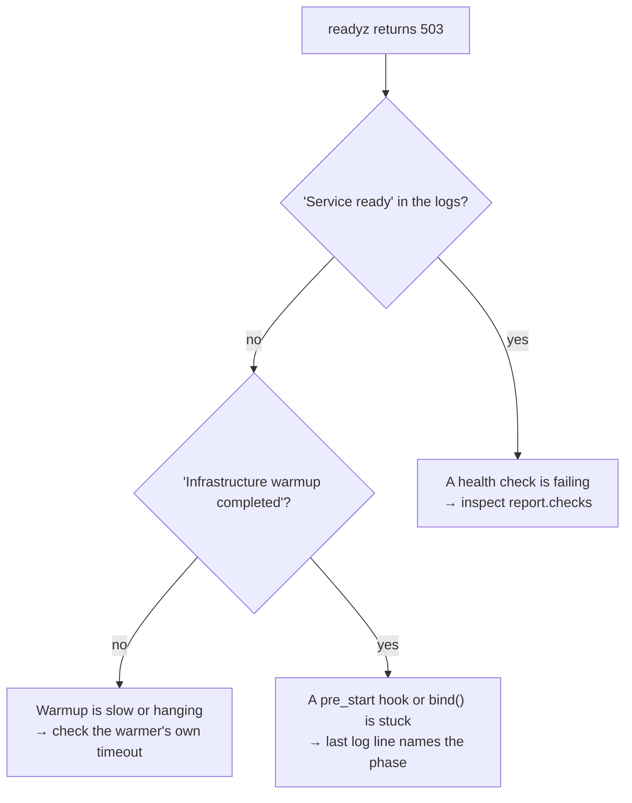

# Runbooks

Symptom → cause → fix, for the things that actually go wrong.

| Symptom | Jump to |
| --- | --- |
| Pod never becomes ready | [Startup](#startup) |
| `CrashLoopBackOff` right after deploy | [Startup](#startup) |
| Process exits `0` immediately | [Startup](#startup) |
| `LookupError: No active unit scope` | [Runtime](#runtime) |
| Two database sessions per request | [Runtime](#runtime) |
| A scheduled job runs several times | [Runtime](#runtime) |
| Logs are not JSON / have no `request_id` | [Observability](#observability) |
| A domain error returns 500 instead of 404 | [Errors](#errors) |
| Pod is `SIGKILL`ed during shutdown | [Shutdown](#shutdown) |
| `DrainTimeoutError` / `CleanupTimeoutError` | [Shutdown](#shutdown) |
| Requests fail during a rollout | [Shutdown](#shutdown) |

---

## Startup

### Pod never becomes ready



Readiness needs **both** the `ready` flag and every registered check passing. The log line
`Service ready` tells you which half is missing.

- **No `Service ready` line at all.** Startup has not finished. Look for `Infrastructure warmup
  completed`; if it is missing, a warmer is hanging — every built-in warmer takes a `timeout`,
  and the whole phase is capped at 60 seconds. If warmup completed, the next suspects are a
  `pre_start` hook awaiting something and a `bind()` that blocks.
- **`Service ready` is there, `readyz` still 503.** A check is returning `False`. Failing checks
  log `Health check failed` with the check name, and `report.checks` names them individually.

### `WarmupTimeoutError` after exactly 60 seconds

The warmup phase has a fixed 60-second ceiling. A dependency that takes longer than that at
startup is a design problem, not a configuration one — give the warmer a tighter timeout of its
own and let health checks handle the slow recovery instead:

```python
PostgresWarmer(session_manager, timeout=10.0)
spec.health.add_check("postgres", PostgresHealthCheck(session_maker))
```

### `CrashLoopBackOff` with `OSError: [Errno 98] Address already in use`

Working as intended. HTTP and gRPC entrypoints open their listening socket during `bind()`,
before readiness flips, precisely so a port clash is a loud startup failure and not a healthy-
looking pod that serves nothing.

Two entrypoints on the same port in one process will do this too.

### `ImportError: ... requires servicewright[fastapi]; install it.`

An adapter was imported without its extra. The message always names the extra. Check that your
image installs the same extras your code imports — a common cause is a `--no-dev` install that
dropped an extra only listed in a dev group.

### `ValueError: Unknown metrics backend 'promehteus'`

A typo in `ObsConfig`. The message lists the registered backends. Backend names are open strings
on purpose (so third-party sinks work), which is why this is a runtime error and not a type error.

### The process starts and exits `0` immediately

An **essential** entrypoint's `serve()` returned. That is the intended behaviour of
`OneShotEntrypoint`, and it is also what happens when a custom entrypoint's loop exits early —
for example a `while not stop.is_set()` loop whose condition was already true, or a consumer that
returned on an empty first poll.

If the entrypoint is genuinely meant to be able to finish without stopping everything else, set
`essential=False`.

### Startup hangs with no log output at all

Observability is configured *first*. If the logging sink itself cannot start, you get silence.
Check `settings.logging`, and try `ObsConfig(logging="stdlib")` to rule the backend out.

---

## Runtime

### `LookupError: No active HTTP unit scope`

`current_unit_scope()` was called outside a request. The usual sources:

- a `BackgroundTask` — Starlette runs it after the handler returns, but the scope is alive until
  the response finishes, so this works; a task you scheduled with `asyncio.create_task()` and did
  not await does **not** inherit the scope reliably;
- module-level or startup code;
- a thread (`run_in_executor`), which has its own contextvars.

Resolve what you need from the scope **inside** the request and pass the object on.

### `RuntimeError: unit_scope() called before bind()`

A custom `ScopedEntrypoint` overrode `bind()` without calling `super().bind(ctx)`. That call is
what captures the container.

```python
async def bind(self, ctx: ServiceContext) -> None:
    await super().bind(ctx)      # ← required
    ...
```

### Two database sessions (or two transactions) per request

dishka's native framework integration (`setup_dishka`) was installed alongside servicewright's
middleware. Both open a `Scope.REQUEST`.

Remove `setup_dishka` and resolve through `UnitScopeDep` / `current_unit_scope()`. See
[dishka](../adapters/dishka.md#do-not-also-call-setup_dishka).

### A scheduled job runs two or three times per tick

You are running more than one replica of the scheduler. APScheduler here is in-process: three
pods means three schedulers.

Keep the scheduler deployment at `replicas: 1`, or make the jobs take a distributed lock. See
[the worker blueprint](../blueprints/worker.md).

### A scheduled job silently stops running

Three usual causes:

| Cause | Symptom | Fix |
| --- | --- | --- |
| Previous run still going | no `Job execution started` for the tick | raise `max_instances`, or make the job faster |
| Run missed while the pod was down | no log line at all | raise `misfire_grace_time` |
| The service is draining | `Job execution started` stops after `SIGTERM` | expected — schedules are paused during drain |

A job that *raises* logs `Job execution failed` and keeps its schedule. If you see nothing at all,
it is one of the three above.

### `Duplicated timeseries in CollectorRegistry`

The Prometheus sink caches instruments per registry, so minting the same metric twice through the
sink is safe. This error means collectors were created **outside** the sink — a module-level
`Counter(...)` imported twice, or a custom `CollectorRegistry` mixed with the default one.

Mint metrics through `ctx.observability.metrics` and keep recorders bound to the entrypoint's
lifetime.

### The second `Service.run()` in one process produces no telemetry

Fixed by design — `shutdown()` returns the manager to its pre-configure state, so a second run
gets a live stack. If you see this, check that you are not holding a reference to sinks captured
during the first run.

---

## Errors

### A domain error returns 500 instead of its status

Check, in order:

1. `default_exception_handlers=False` was passed — then nothing maps `ServiceError`.
2. The error carries `public=False` — masking is doing exactly what it says, and the real code is
   in the log line next to the 500.
3. The exception escaped outside the handler stack — for example from a background task, or from
   inside a custom middleware that runs *outside* the exception handlers.
4. A custom `error_renderer` raised. Rendering must be total; use `to_json_safe` for anything that
   is not a JSON primitive.

### A domain error becomes `INTERNAL` over gRPC

`map_service_errors=False`, or the servicer swallowed the exception itself. The
`ServiceErrorInterceptor` is installed innermost precisely so your own interceptors cannot
intercept the domain error first — but code inside the servicer still can.

### Validation errors have a different shape than the rest

They should not — every default handler renders through the same renderer. A 422 with a foreign
shape usually means FastAPI's own `RequestValidationError` handler was re-registered after
servicewright's.

---

## Observability

### Logs are plain text instead of JSON

- `settings.logging` is `None` → the concern is off and the root logger is untouched.
- `ObsConfig` has no `logging` backend selected.
- Something reconfigured logging **after** the Host did. Litestar's `LoggingConfig` is the classic
  offender; the adapter forces it to `None` for that reason.

### Log lines have no `request_id`

The identifier is bound into the context store by the transport, and pushed into structlog
contextvars by a `ContextSetter`. If it is missing:

| Cause | Check |
| --- | --- |
| Logging backend is `stdlib`, not `structlog` | `stdlib` renders `extra`, not contextvars |
| `MiddlewareConfig(context=False)` | the context layer is off |
| `context_setters=[]` was passed explicitly | bridging disabled |
| You are using `print()` | it does not go through logging at all |

### Traces have no spans for HTTP requests

Request spans need the `fastapi-tracing` extra *and* a configured `settings.tracing`. Without the
instrumentor the sink degrades with a warning rather than failing.

Also check `settings.tracing.excluded_urls` and remember that `/system/*` is excluded by default.

### Metrics endpoint returns 404

`FastApiEntrypoint(metrics=True)` exposes `/system/metrics`. The standalone server on
`settings.metrics.port` is a *different* endpoint, enabled by `settings.metrics.enabled`. A
socket-less worker needs the second one.

---

## Shutdown

### The pod is `SIGKILL`ed in the middle of the drain

`terminationGracePeriodSeconds` is smaller than what the service needs:

```
terminationGracePeriodSeconds > drain_grace_seconds + cleanup_timeout_seconds + slack
```

Exit code `137` means `SIGKILL` arrived. Raise the grace period, or lower the budgets.

### `DrainTimeoutError` in the logs

An entrypoint did not finish draining within `drain_grace_seconds + 5s`. The log line names the
`kind`, so you know which one.

- HTTP: a request is running longer than the window. Bound your handlers, or raise the window.
- Scheduler: a job is running long. It is logged with `job_id` and `run_id`.
- Custom entrypoint: your `drain()` is not returning — check the in-flight polling loop.

The error is raised out of `run()` only if nothing else is already propagating, so it never masks
the real failure.

### `CleanupTimeoutError` in the logs

A post-drain step blew `cleanup_timeout_seconds`. The `phase` field says which: `stop`,
`pre-shutdown hooks`, `observability shutdown` or `post-shutdown hooks`.

Sentry flushes and OTLP exports are the usual cause on a bad network day. Raising the budget to
20–30 seconds for a batch job is reasonable; for an API, prefer keeping it short.

### Shutdown always takes the full grace window, even with no traffic

Something is sleeping instead of waiting on the stop event:

```python
await asyncio.sleep(POLL_INTERVAL)                       # ❌ ignores stop

with contextlib.suppress(TimeoutError):                  # ✅ wakes immediately
    await asyncio.wait_for(stop.wait(), timeout=POLL_INTERVAL)
```

### Requests fail with 502/504 during a rollout

readiness flips to `false` before anything stops accepting, so the usual causes are outside the
process:

| Cause | Fix |
| --- | --- |
| Probe interval too long | `readinessProbe.periodSeconds: 5`, `failureThreshold: 2` |
| Endpoint propagation lag | raise `drain_grace_seconds` so the pod keeps serving longer |
| `maxUnavailable > 0` | set `maxUnavailable: 0`, `maxSurge: 1` |
| Client keep-alive to a dead pod | it is a client-side retry policy problem, not a server one |

### What the exit code means

| Code | Meaning |
| --- | --- |
| `0` | graceful stop |
| non-zero from your exception | an essential entrypoint or startup failed |
| `130` | second `SIGINT` — immediate exit (`128 + 2`) |
| `143` | terminated by `SIGTERM` without a graceful path (`128 + 15`) |
| `137` | `SIGKILL` — the grace period expired |

---

## Reproducing locally

Most of the above reproduces without Kubernetes:

```bash
# start the service, then in another shell:
kill -TERM <pid>          # the graceful path
kill -TERM <pid> <pid>    # twice → immediate exit, 128 + 15
```

```python
# drive the lifecycle in a test, with no signals at all
stop = asyncio.Event()
task = asyncio.create_task(service.run(settings, stop=stop))
await wait_until_ready(spec.health)
stop.set()
await task
```

`FakeEntrypoint.events` records the exact `bind → serve → drain → stop` order, and
`FakeContainer.unit_scopes_opened` tells you how many scopes were opened. See
[Testing](../guides/testing.md).

## Next

- [Production checklist](checklist.md) — most of this list, before it happens.
- [Kubernetes](kubernetes.md) — the configuration these runbooks assume.
